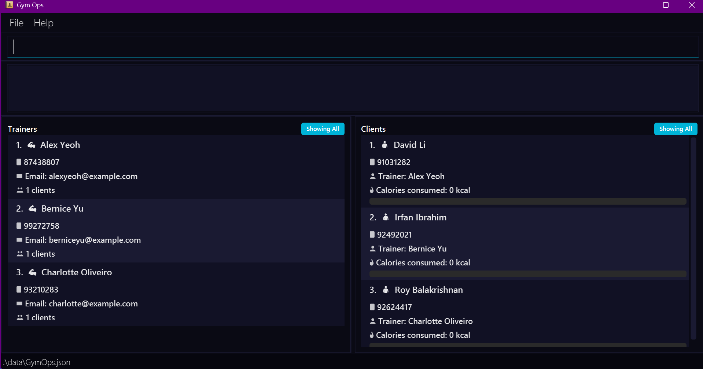

# GymOps

GymOps is a **CLI-centric** desktop management application for **gym supervisors/managers** who oversee multiple trainers and their client assignments.

## Target user

Tech-savvy gym supervisors who:

* manage trainer-client assignments and occasional trainer substitutions
* operate primarily on desktop
* prefer fast, keyboard-based command input over menu-driven workflows

## Core value

High-speed management of a **hierarchical trainer → client** structure, plus lightweight tracking of each client’s:

* daily calorie target and intake
* current workout focus (e.g., Chest/Back/Legs/Core)

## Key workflows

* **Trainer → Client operations**: add clients assigned to trainers, with a GUI feature to easily view a trainer's designated clients simply by clicking on their card.
* **Daily tracking**: set calorie targets, log intake, set workout focus, record client remarks, and manage membership validity.

## Command prefixes (Trainer vs Client)

GymOps distinguishes trainer and client operations with explicit commands/prefixes for speed and clarity.

Examples:

* Add a trainer: `add-trainer n/John Doe p/98765432 e/johndoe@example.com`

* Add a client assigned to a trainer: `add-client n/Alice Lim p/81234567 t/1 [v/YYYY-MM-DD]`
* Reassign a client to a different trainer: `reassign-client 2 t/1`
* Delete a trainer or client (typed delete): `delete t/1` / `delete c/1` 

Calorie tracking:

* Set target: `set-calorie-target 1 cal/2500`
* Log intake: `log-calorie 1 cal/500`
* Set focus: `set-focus c/1 f/Chest`

## v1.0 feature list

* Trainer management: `add-trainer`, `delete-trainer`, `list-t`, `find-t`
* Client management: `add-client`, `delete-client`, `list-c`, `find-c`, `reassign-client`
* Tracking: `set-calorie-target`, `log-calorie`, `set-focus`, `remark`, `set-validity`
* General: `list`, `find`, `delete` (typed), `clear`, `help`, `exit`

## Scope

GymOps focuses on **operational coordination**, not coaching:

* Tracks high-level workout focus and calories only
* Does **not** store exact exercises (e.g., dumbbell press) or exact meals (e.g., grilled steak)
* The app is for the supervisor; trainers/clients do not log in to GymOps

## Documentation

* User Guide: [docs/UserGuide.md](docs/UserGuide.md)
* Developer Guide: [docs/DeveloperGuide.md](docs/DeveloperGuide.md)

## Acknowledgement

This project is based on AddressBook-Level3 by the [SE-EDU initiative](https://se-education.org).
