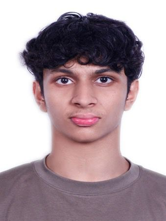
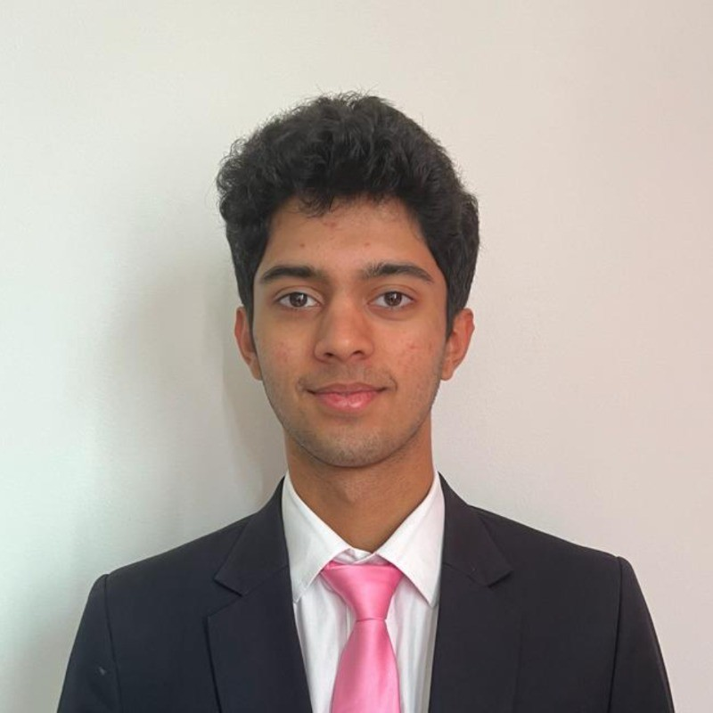

We are a team based in the [School of Computing, National University of Singapore](https://www.comp.nus.edu.sg).

## Project team

### Adib Shifas

[[github](https://github.com/AdibShifas)]
[[portfolio](team/adibshifas.md)]

* Role: Developer
* Responsibilities: Documentation + Integration

### Manish Choudhary

[[github](https://github.com/NotDotManish)]

* Role: Developer
* Responsibilities: Documentation + Integration

### Prithvi Phanish Bhardwaj

[[github](https://github.com/prithvibhardwaj)]

* Role: Developer
* Responsibilities: Documentation + Integration

### Nguyen Hoang Nam

[[github](http://github.com/ephtale)]

* Role: Developer
* Responsibilities: QA, CI

### Rajeshprabu Sidharth

[[github](https://github.com/TheSputnikSpacecraft)]
[[portfolio](https://voluble-tulumba-eca9f6.netlify.app/)]

* Role: Developer
* Responsibilities: Testing, In charge of `Logic`
