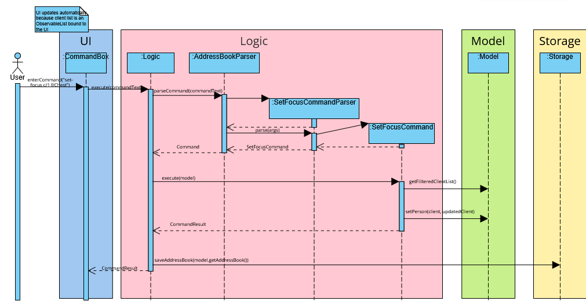

* Table of Contents
{:toc}

--------------------------------------------------------------------------------------------------------------------

## **Acknowledgements**

* This project is based on AddressBook-Level3 by the [SE-EDU initiative](https://se-education.org). The overall architecture (UI/Logic/Model/Storage split), command parsing/execution flow, and JSON storage design were adapted from AB3.
* The structure and some sections/diagrams in this Developer Guide were adapted from the AddressBook-Level3 Developer Guide, then updated to reflect GymOps-specific features and command formats.
* PlantUML usage and conventions were guided by the [se-edu PlantUML tutorial](https://se-education.org/guides/tutorials/plantUml.html).
* The Metro-style JavaFX button CSS in the dark theme is adapted from the JMetro styling example by Pedro Duque Vieira (PixelDuke) as cited in the stylesheet comments.

--------------------------------------------------------------------------------------------------------------------

## **Setting up, getting started**

Refer to the guide [_Setting up and getting started_](SettingUp.md).

--------------------------------------------------------------------------------------------------------------------

## **Design**

:bulb: **Tip:** The `.puml` files used to create diagrams are in this document `docs/diagrams` folder. Refer to the [_PlantUML Tutorial_ at se-edu/guides](https://se-education.org/guides/tutorials/plantUml.html) to learn how to create and edit diagrams.

### Architecture

The ***Architecture Diagram*** given above explains the high-level design of the App.

Given below is a quick overview of main components and how they interact with each other.

**Main components of the architecture**

**`Main`** (consisting of classes [src/main/java/seedu/address/Main.java](../src/main/java/seedu/address/Main.java) and [src/main/java/seedu/address/MainApp.java](../src/main/java/seedu/address/MainApp.java)) is in charge of the app launch and shut down.
* At app launch, it initializes the other components in the correct sequence, and connects them up with each other.
* At shut down, it shuts down the other components and invokes cleanup methods where necessary.

The bulk of the app's work is done by the following four components:

* [**`UI`**](#ui-component): The UI of the App.
* [**`Logic`**](#logic-component): The command executor.
* [**`Model`**](#model-component): Holds the data of the App in memory.
* [**`Storage`**](#storage-component): Reads data from, and writes data to, the hard disk.

[**`Commons`**](#common-classes) represents a collection of classes used by multiple other components.

**How the architecture components interact with each other**

The *Sequence Diagram* below shows how the components interact with each other for the scenario where the user issues the command `delete c/1`.

Each of the four main components (also shown in the diagram above),

* defines its *API* in an `interface` with the same name as the Component.
* implements its functionality using a concrete `{Component Name}Manager` class (which follows the corresponding API `interface` mentioned in the previous point.

For example, the `Logic` component defines its API in the `Logic.java` interface and implements its functionality using the `LogicManager.java` class which follows the `Logic` interface. Other components interact with a given component through its interface rather than the concrete class (reason: to prevent outside component's being coupled to the implementation of a component), as illustrated in the (partial) class diagram below.

The sections below give more details of each component.

### UI component

The **API** of this component is specified in [src/main/java/seedu/address/ui/Ui.java](../src/main/java/seedu/address/ui/Ui.java)

The UI consists of a `MainWindow` that is made up of parts e.g.`CommandBox`, `ResultDisplay`, `PersonListPanel`, `StatusBarFooter` etc. All these, including the `MainWindow`, inherit from the abstract `UiPart` class which captures the commonalities between classes that represent parts of the visible GUI.

The `UI` component uses the JavaFx UI framework. The layout of these UI parts are defined in matching `.fxml` files that are in the `src/main/resources/view` folder. For example, the layout of the [src/main/java/seedu/address/ui/MainWindow.java](../src/main/java/seedu/address/ui/MainWindow.java) is specified in [src/main/resources/view/MainWindow.fxml](../src/main/resources/view/MainWindow.fxml)

The `UI` component,

* executes user commands using the `Logic` component.
* listens for changes to `Model` data so that the UI can be updated with the modified data.
* keeps a reference to the `Logic` component, because the `UI` relies on the `Logic` to execute commands.
* depends on some classes in the `Model` component, as it displays `Person` object residing in the `Model`.

### Logic component

**API** : [src/main/java/seedu/address/logic/Logic.java](../src/main/java/seedu/address/logic/Logic.java)

Here's a (partial) class diagram of the `Logic` component:

The sequence diagram below illustrates the interactions within the `Logic` component, taking the `execute("delete c/1")` API call as an example.

:information_source: **Note:** The lifeline for `DeleteCommandParser` should end at the destroy marker (X) but due to a limitation of PlantUML, the lifeline continues till the end of diagram.

How the `Logic` component works:

1. When `Logic` is called upon to execute a command, it is passed to an `AddressBookParser` object which in turn creates a parser that matches the command (e.g., `DeleteCommandParser`) and uses it to parse the command.
1. This results in a `Command` object (more precisely, an object of one of its subclasses e.g., `DeleteCommand`) which is executed by the `LogicManager`.
1. The command can communicate with the `Model` when it is executed (e.g. to delete a person). 
   Note that although this is shown as a single step in the diagram above (for simplicity), in the code it can take several interactions (between the command object and the `Model`) to achieve.
1. The result of the command execution is encapsulated as a `CommandResult` object which is returned back from `Logic`.

Here are the other classes in `Logic` (omitted from the class diagram above) that are used for parsing a user command:

How the parsing works:
* When called upon to parse a user command, the `AddressBookParser` class creates an `XYZCommandParser` (`XYZ` is a placeholder for the specific command name e.g., `AddCommandParser`) which uses the other classes shown above to parse the user command and create a `XYZCommand` object (e.g., `AddCommand`) which the `AddressBookParser` returns back as a `Command` object.
* All `XYZCommandParser` classes (e.g., `AddCommandParser`, `DeleteCommandParser`, ...) inherit from the `Parser` interface so that they can be treated similarly where possible e.g, during testing.

### Model component
**API** : [src/main/java/seedu/address/model/Model.java](../src/main/java/seedu/address/model/Model.java)

The `Model` component,

* stores the address book data i.e., all `Person` objects (which are contained in a `UniquePersonList` object).
* stores the currently 'selected' `Person` objects (e.g., results of a search query) as a separate _filtered_ list which is exposed to outsiders as an unmodifiable `ObservableList<Person>` that can be 'observed' e.g. the UI can be bound to this list so that the UI automatically updates when the data in the list change.
* stores a `UserPref` object that represents the user’s preferences. This is exposed to the outside as a `ReadOnlyUserPref` objects.
* does not depend on any of the other three components (as the `Model` represents data entities of the domain, they should make sense on their own without depending on other components)

:information_source: **Note:** An alternative (arguably, a more OOP) model is given below. It has a `Tag` list in the `AddressBook`, which `Person` references. This allows `AddressBook` to only require one `Tag` object per unique tag, instead of each `Person` needing their own `Tag` objects. 

### Storage component

**API** : [src/main/java/seedu/address/storage/Storage.java](../src/main/java/seedu/address/storage/Storage.java)

The `Storage` component,
* can save both address book data and user preference data in JSON format, and read them back into corresponding objects.
* inherits from both `AddressBookStorage` and `UserPrefStorage`, which means it can be treated as either one (if only the functionality of only one is needed).
* depends on some classes in the `Model` component (because the `Storage` component's job is to save/retrieve objects that belong to the `Model`)

### Common classes

Classes used by multiple components are in the `seedu.address.commons` package.

--------------------------------------------------------------------------------------------------------------------

## **Implementation**

This section describes some noteworthy details on how certain features are implemented.

### Client attributes

GymOps extends the base `Person` model with a `Client` subtype that includes client-specific attributes.

Client-specific attributes include:

* **Assigned trainer**: stored as the trainer's phone and name fields in `Client`.
* **Calorie tracking**: `calorieTarget` (0 means not set) and `calorieIntake`.
* **Workout focus**: a short, letters-only string (e.g., `Chest`), stored as a `WorkoutFocus` value object.
* **Remark**: free-text operational notes (must be non-empty after trimming), stored as a `Remark` value object.
* **Membership validity**: an optional membership validity date (YYYY-MM-DD), stored as a `Validity` value object.

These values are stored in the `Client` model and are persisted through `JsonAdaptedPerson`.

#### Implementation

At the model layer, `Client` is a `Person` subtype with additional client-only fields:

* **Assigned trainer**: stored as `trainerPhone` and `trainerName` fields.
* **Calorie tracking**: `calorieTarget` and `calorieIntake` are stored as integers, where `0` means "not set" for `calorieTarget`.
* **Workout focus**: stored as an `Optional<WorkoutFocus>`.
* **Remark**: stored as an `Optional<Remark>`.
* **Membership validity**: stored as an `Optional<Validity>` (ISO-8601 `YYYY-MM-DD`).

`WorkoutFocus` and `Remark` are value objects that encapsulate validation:

* `WorkoutFocus` only allows letters (`[A-Za-z]+`).
* `Remark` must be non-empty after trimming.

To keep `Client` immutable, each client-only update is implemented using a copy-with style API:

* `Client#withTrainer(...)`
* `Client#withCalorieTarget(...)`
* `Client#withCalorieIntake(...)`
* `Client#withWorkoutFocus(...)`
* `Client#withRemark(...)`
* `Client#withValidity(...)`

All client-attribute commands follow the same high-level pattern:

1. Resolve the target client from the current `Model#getFilteredClientList()` using the user-provided index.
2. Create an updated `Client` instance using one of the `withX(...)` methods.
3. Replace the old instance via `Model#setPerson(oldClient, updatedClient)`.
4. Persist the updated address book through `Storage` (triggered by `LogicManager`).

Storage is implemented through `JsonAdaptedPerson`, which serialises/deserialises all client-only fields.
For optional fields (`workoutFocus`, `remark`), `null` is stored when absent and mapped back to `Optional.empty()` on load.
`JsonAdaptedPerson` also includes a small backward-compatibility fallback that infers the person type when `type` is missing.

#### Command Flow

The following sequence occurs when executing `set-focus c/1 f/Chest`:

1. The supervisor enters `set-focus c/1 f/Chest`.
2. `AddressBookParser` identifies the command word `set-focus`.
3. `SetFocusCommandParser` parses the client index (`c/`) and focus value (`f/`).
4. A `SetFocusCommand` object is created.
5. `LogicManager` executes the command.
6. The command retrieves the client from the filtered client list.
7. `Client#withWorkoutFocus(...)` is called to create an updated `Client`.
8. `Model#setPerson(...)` replaces the old client with the updated client.
9. `LogicManager` saves the updated address book via `Storage#saveAddressBook(...)`.
10. The UI updates because it observes the model’s filtered lists.

The sequence diagram below shows a typical execution flow for `set-focus c/1 f/Chest`:

Other client attribute commands follow the same flow, with small differences:

* `remark INDEX r/REMARK` updates `Client#remark`.
* `set-calorie-target INDEX cal/CALORIES` updates `Client#calorieTarget`.
* `log-calorie INDEX cal/CALORIES` adds to `Client#calorieIntake` rather than overwriting it.
* `reassign-client CLIENT_INDEX t/TRAINER_INDEX` reads both the filtered client list and filtered trainer list and updates `trainerPhone` + `trainerName`.
* `set-validity INDEX v/YYYY-MM-DD` updates `Client#validity`.

#### Filtering Behaviour

All client-attribute commands resolve the target client based on the **currently displayed client list** (`Model#getFilteredClientList()`).
As a result, the same client can have different indices depending on:

* whether a trainer is currently selected (client list filtering), and
* whether the user has applied `find-clients`.

For `reassign-client`, the `CLIENT_INDEX` is resolved from the displayed client list and the `t/TRAINER_INDEX` is resolved from the displayed trainer list.

#### Error Handling

GymOps defends at both parsing and execution layers:

* Invalid formats (missing prefixes/arguments) are rejected by the relevant `XYZCommandParser` with a `ParseException`.
* Invalid attribute values are rejected by their value objects (e.g., `WorkoutFocus` rejects non-letter input; `Remark` rejects blank remarks).
* Invalid validity dates are rejected by `Validity` (must be a valid date in `YYYY-MM-DD` format).
* Invalid indices (out of bounds, or pointing at a non-client in the client list) cause the command to throw a `CommandException`.

#### Usage Scenario

Given below is an example scenario showing how client attributes are updated over time.

Step 1. The supervisor lists clients using `list-clients` (or narrows down to a smaller set using `find-clients`).

Step 2. The supervisor sets the workout focus for the first client using `set-focus c/1 f/Chest`.
GymOps updates the client’s workout focus, persists the change, and the UI updates to show the focus label on that client’s card.

Step 3. The supervisor records an operational note using `remark 1 r/Recovering from ACL surgery`.
GymOps overwrites any existing remark and updates the client card.

Step 4. The supervisor sets a daily calorie target using `set-calorie-target 1 cal/2000`.
GymOps updates the target and persists the change.

Step 5. The supervisor logs calorie intake throughout the day using `log-calorie 1 cal/500`.
GymOps adds the new amount to the existing intake total (note: the current version does not automatically reset intake totals by date).

#### Design Considerations

**Aspect: Representation of optional client-only fields**

* **Option 1 (current choice):** Store workout focus and remark as `Optional<...>`.
   * Pros: Expresses "absent vs present" explicitly and avoids sentinel values.
   * Cons: Slightly more boilerplate at the storage and UI layers.
* **Option 2:** Store empty strings when not set.
   * Pros: Simpler serialisation.
   * Cons: Blurs "unset" vs "set to empty", and makes validation/formatting harder.

**Aspect: Representation of calorie target**

* **Option 1 (current choice):** Use `int calorieTarget` where `0` means "not set".
   * Pros: Lightweight and easy to display without null-handling.
   * Cons: Overloads the meaning of `0` (cannot represent a literal target of 0).
* **Option 2:** Use `OptionalInt` for calorie target.
   * Pros: More semantically precise.
   * Cons: Adds complexity to parsing, serialisation, and UI formatting.

#### Future Improvements

* Reset calorie intake totals by date (e.g., auto-reset at midnight, or store intake logs with timestamps).
* Unify index conventions for client-attribute commands (some commands use `c/INDEX` while others use a plain `INDEX`).
* Consider using a trainer identifier reference (instead of duplicating trainer name + phone) if trainer details become editable.
* Improve membership validity UX (e.g., visually highlight expired validity dates in the client card).

**UI**:

* `PersonCard` displays workout focus and remark labels for clients when present.

### Trainer selection and client list filtering

GymOps displays two lists in the UI: a **trainer list** and a **client list**.

To support “select a trainer → filter clients”, the `Model` exposes:

* `Model#setSelectedTrainer(Trainer)`
* `Model#clearSelectedTrainer()`
* `Model#getSelectedTrainer()`

`ModelManager` stores the selected trainer’s phone (as an `Optional<Phone>`) and uses it to refine the client list predicate. This keeps the filtering logic inside `Model`, while allowing `UI` to remain a thin consumer of observable lists.

### Find keyword validation

`find` is parsed by `FindCommandParser`, which:

* rejects empty input (no keywords), and
* rejects any keyword that is not alphanumeric (letters and/or digits only).

The resulting `FindCommand` filters the displayed list using `NameContainsKeywordsPredicate`.

`find-trainers` and `find-clients` follow the same keyword validation rules and filter only their respective lists.

### \[Proposed\] Undo/redo feature

#### Proposed Implementation

The proposed undo/redo mechanism is facilitated by `VersionedAddressBook`. It extends `AddressBook` with an undo/redo history, stored internally as an `addressBookStateList` and `currentStatePointer`. Additionally, it implements the following operations:

* `VersionedAddressBook#commit()` — Saves the current address book state in its history.
* `VersionedAddressBook#undo()` — Restores the previous address book state from its history.
* `VersionedAddressBook#redo()` — Restores a previously undone address book state from its history.

These operations are exposed in the `Model` interface as `Model#commitAddressBook()`, `Model#undoAddressBook()` and `Model#redoAddressBook()` respectively.

Given below is an example usage scenario and how the undo/redo mechanism behaves at each step.

Step 1. The user launches the application for the first time. The `VersionedAddressBook` will be initialized with the initial address book state, and the `currentStatePointer` pointing to that single address book state.

Step 2. The user executes `delete c/5` to delete the 5th client in the currently displayed client list. The `delete` command calls `Model#commitAddressBook()`, causing the modified state of the address book after the `delete c/5` command executes to be saved in the `addressBookStateList`, and the `currentStatePointer` is shifted to the newly inserted address book state.

Step 3. The user executes `add-trainer n/David Tan p/91234567 e/david@example.com` to add a new trainer. The `add-trainer` command also calls `Model#commitAddressBook()`, causing another modified address book state to be saved into the `addressBookStateList`.

:information_source: **Note:** If a command fails its execution, it will not call `Model#commitAddressBook()`, so the address book state will not be saved into the `addressBookStateList`.

Step 4. The user now decides that adding the person was a mistake, and decides to undo that action by executing the `undo` command. The `undo` command will call `Model#undoAddressBook()`, which will shift the `currentStatePointer` once to the left, pointing it to the previous address book state, and restores the address book to that state.

:information_source: **Note:** If the `currentStatePointer` is at index 0, pointing to the initial AddressBook state, then there are no previous AddressBook states to restore. The `undo` command uses `Model#canUndoAddressBook()` to check if this is the case. If so, it will return an error to the user rather
than attempting to perform the undo.

The following sequence diagram shows how an undo operation goes through the `Logic` component:

:information_source: **Note:** The lifeline for `UndoCommand` should end at the destroy marker (X) but due to a limitation of PlantUML, the lifeline reaches the end of diagram.

Similarly, how an undo operation goes through the `Model` component is shown below:

The `redo` command does the opposite — it calls `Model#redoAddressBook()`, which shifts the `currentStatePointer` once to the right, pointing to the previously undone state, and restores the address book to that state.

:information_source: **Note:** If the `currentStatePointer` is at index `addressBookStateList.size() - 1`, pointing to the latest address book state, then there are no undone AddressBook states to restore. The `redo` command uses `Model#canRedoAddressBook()` to check if this is the case. If so, it will return an error to the user rather than attempting to perform the redo.

Step 5. The user then decides to execute the command `list`. Commands that do not modify the address book, such as `list`, will usually not call `Model#commitAddressBook()`, `Model#undoAddressBook()` or `Model#redoAddressBook()`. Thus, the `addressBookStateList` remains unchanged.

Step 6. The user executes `clear`, which calls `Model#commitAddressBook()`. Since the `currentStatePointer` is not pointing at the end of the `addressBookStateList`, all address book states after the `currentStatePointer` will be purged. Reason: It no longer makes sense to redo the `add-trainer ...` command. This is the behavior that most modern desktop applications follow.

The following activity diagram summarizes what happens when a user executes a new command:

#### Design considerations:

**Aspect: How undo & redo executes:**

* **Alternative 1 (proposed):** Saves the entire address book.
  * Pros: Easy to implement.
  * Cons: May have performance issues in terms of memory usage.

* **Alternative 2:** Individual command knows how to undo/redo by
  itself.
  * Pros: Will use less memory (e.g. for `delete`, just save the person being deleted).
  * Cons: We must ensure that the implementation of each individual command are correct.

### \[Proposed\] Data archiving

GymOps does not currently support archiving trainers/clients.

If this feature is added, a minimal approach is to represent an archived entity using a boolean flag (e.g., `archived`) and filter archived entries out of the default trainer/client lists. Commands such as `archive t/INDEX`, `archive c/INDEX`, `restore t/INDEX`, and `restore c/INDEX` can be added to toggle the flag.

--------------------------------------------------------------------------------------------------------------------

## **Documentation, logging, testing, configuration, dev-ops**

* [Documentation guide](Documentation.md)
* [Testing guide](Testing.md)
* [Logging guide](Logging.md)
* [Configuration guide](Configuration.md)
* [DevOps guide](DevOps.md)

--------------------------------------------------------------------------------------------------------------------

## **Appendix: Requirements**

### Product scope

**Target user profile**:

* is a gym supervisor/manager overseeing multiple trainers and their respective client bases
* is tech-savvy, comfortable on desktop, and prefers CLI input over GUI navigation
* types quickly and values rapid data entry for operational coordination
* frequently handles trainer substitutions, client reallocations, and handovers across a shifting weekly schedule
* needs to track high-level client requirements (calorie targets/intake and workout focus) without managing detailed coaching prescriptions

**Value proposition**: reduce the operational burden of managing trainer–client relationships during frequent schedule changes by enabling fast CLI updates and reassignment, while preserving clients’ workout-relevant details (workout focus and calories) for handover.

### User stories

Priorities: High (must have) - `* * *`, Medium (nice to have) - `* *`, Low (unlikely to have) - `*`

Some user stories describe planned/proposed features that may not be implemented in the current version.

| Priority | As a …​                                    | I want to …​                     | So that I can…​                                                        |
| -------- | ------------------------------------------ | ------------------------------ | ---------------------------------------------------------------------- |
| `* * *`  | new supervisor user                        | see usage instructions         | refer to instructions when I forget how to use GymOps                  |
| `* * *`  | supervisor                                 | add a new trainer              | build and maintain my roster of staff                                  |
| `* * *`  | supervisor                                 | list all trainers              | see which trainers are currently employed/registered                    |
| `* * *`  | supervisor                                 | delete a trainer who has no assigned clients | remove trainers who have left the gym                      |
| `* * *`  | supervisor                                 | add a client assigned to a trainer | allocate responsibility for that member                             |
| `* * *`  | supervisor                                 | list all clients (optionally by trainer) | view allocations and a trainer’s current client base            |
| `* * *`  | supervisor                                 | delete a client                | remove members who have cancelled their membership                      |
| `* * *`  | supervisor                                 | reassign a client to another trainer | handle trainer unavailability and schedule changes                 |
| `* * *`  | supervisor                                 | set a client’s membership validity date | track whether a client’s membership is still valid                |
| `* * *`  | supervisor                                 | set a calorie target for a client | record their nutritional goal (e.g., 2500 kcal)                     |
| `* * *`  | supervisor                                 | log a client’s calorie intake  | track whether they are meeting their nutritional goals                  |
| `* * *`  | supervisor                                 | set a workout focus for a client | preserve the right context during handovers                          |
| `* * *`  | supervisor                                 | view a client’s progress summary | see target vs consumed calories and workout focus quickly            |
| `* *`    | supervisor                                 | find trainers/clients by name  | locate their record without scrolling through long lists                |
| `* *`    | supervisor                                 | add a remark to a client       | keep operational notes (e.g., injuries, payment checks)                 |
| `* *`    | supervisor                                 | import data from a JSON file   | restore data from backups or move data between computers                |
| `* *`    | supervisor                                 | export data to a JSON file     | share or archive data outside of the app                                |
| `* *`    | supervisor                                 | clear all entries              | reset the system for a new term/season                                  |
| `*`      | supervisor                                 | undo the last command          | quickly recover from accidental deletions/edits                         |
| `*`      | supervisor                                 | see a time/day-based handover view | know which clients’ requirements are most relevant right now        |

### Use cases

(For all use cases below, the **System** is `GymOps` and the **Actor** is the `supervisor`, unless specified otherwise)

**Use case: Add a client to a trainer**

**MSS**

1.  Supervisor requests to list trainers.
2.  GymOps shows a list of trainers with index numbers.
3.  Supervisor issues the command to add a client, specifying a trainer index.
4.  GymOps validates the input and adds the client assigned to the specified trainer.

    Use case ends.

**Extensions**

* 2a. The trainer list is empty.

   * 2a1. GymOps shows an empty list message.

      Use case resumes at step 1.

* 3a. The trainer index is invalid (not a number, missing, or out of bounds).

   * 3a1. GymOps shows an error message.

      Use case resumes at step 2.

* 3b. The client’s phone number already exists in the system.

   * 3b1. GymOps rejects the command and shows an error message.

      Use case resumes at step 2.

**Use case: Reassign a client to another trainer**

**MSS**

1.  Supervisor requests to list clients.
2.  GymOps shows a list of clients with index numbers.
3.  Supervisor requests to list trainers.
4.  GymOps shows a list of trainers with index numbers.
5.  Supervisor issues the command to reassign a client to a new trainer (e.g., `reassign-client 2 t/1`).
6.  GymOps validates the input and updates the client’s assigned trainer.

   Use case ends.

**Extensions**

* 2a. The client list is empty.

   * 2a1. GymOps shows an empty list message.

      Use case resumes at step 1.

* 5a. The client index is invalid.

   * 5a1. GymOps shows an error message.

      Use case resumes at step 2.

* 5b. The trainer index is invalid.

   * 5b1. GymOps shows an error message.

      Use case resumes at step 4.

**Use case: Update a client’s daily calories (target + intake)**

**MSS**

1.  Supervisor requests to find clients by name.
2.  GymOps shows a list of matching clients.
3.  Supervisor identifies the relevant client and issues a command to set the client’s calorie target.
4.  GymOps updates the client’s calorie target.
5.  Supervisor issues a command to log calorie intake for the same client.
6.  GymOps adds the logged intake to the client’s total intake for the day.

   Use case ends.

**Extensions**

* 2a. No clients match the search keywords.

   * 2a1. GymOps shows an empty results message.

      Use case ends.

* 3a. The calorie target value is invalid (not a number or out of the accepted range).

   * 3a1. GymOps rejects the command and shows an error message.

      Use case resumes at step 2.

* 5a. The logged intake value is invalid (not a positive integer).

   * 5a1. GymOps rejects the command and shows an error message.

      Use case resumes at step 2.

**Use case: Delete a trainer**

**MSS**

1.  Supervisor requests to list trainers.
2.  GymOps shows a list of trainers with index numbers.
3.  Supervisor issues the command to delete a trainer by index.
4.  GymOps deletes the trainer.

   Use case ends.

**Extensions**

* 3a. The given trainer index is invalid.

   * 3a1. GymOps shows an error message.

      Use case resumes at step 2.

* 4a. The trainer still has assigned clients.

   * 4a1. GymOps rejects the deletion and informs the supervisor to reassign or delete those clients first.

      Use case resumes at step 2.

### Non-Functional Requirements

1.  Should work on any _mainstream OS_ (Windows, Linux, macOS) as long as it has Java `17` or above installed.
2.  Should be optimized for a CLI-centric workflow (i.e., common operations are achievable with a small number of commands and without requiring mouse input).
3.  For a dataset of up to 100 trainers and 1000 clients, typical commands (list, find, add-trainer, add-client, delete, set-calorie-target, log-calorie, set-focus, remark) should complete within 1 second on a typical laptop.
4.  Data should be persisted locally and remain intact after restarting the application.
5.  The system should not require an internet connection for normal operation.
6.  The system is single-user (supervisor-only) and does not require multiple logins or role-based access control.
7.  JSON import/export should preserve all relevant fields needed for operations (trainer/client identities and client tracking fields) without loss.

### Glossary

* **Supervisor**: The primary (and only) intended user of GymOps; manages allocations and operational coordination.
* **Trainer**: A staff member who trains clients. In GymOps, trainers are the parent entity that clients are assigned to.
* **Client**: A gym member assigned to exactly one trainer at any point in time.
* **Assignment**: The association linking a client to a trainer.
* **Reassignment**: Moving a client’s assignment from one trainer to another.
* **Workout focus**: A high-level muscle group emphasis (e.g., Chest, Back, Legs, Core), not specific exercises.
* **Calorie target**: A client’s intended daily calorie goal (kcal).
* **Calorie intake**: The calories logged as consumed by a client for the day (kcal).
* **Remark**: A free-text operational note about a client (e.g., injuries, payment flags).
* **JSON**: JavaScript Object Notation format used for import/export and local data storage.
* **Mainstream OS**: Windows, Linux, macOS.
* **GymOps**: The name of the application.

--------------------------------------------------------------------------------------------------------------------

## **Appendix: Instructions for Manual Testing**

Given below are instructions to test the app manually.

:information_source: **Note:** These instructions only provide a starting point for testers to work on;
testers are expected to do more *exploratory* testing.

### Launch and shutdown

1. Initial launch

   1. Download the jar file and copy into an empty folder

   1. Double-click the jar file.
      Expected: Shows the GUI with a set of sample trainers and clients. The window size may not be optimum.

      Notes for testers:
      * If double-clicking the `.jar` does not launch the app, run it using `java -jar GymOps.jar` from a terminal.
      * Do not place the app in a write-protected folder (it may fail to save changes).

1. Saving window preferences

   1. Resize the window to an optimum size. Move the window to a different location. Close the window.

   1. Re-launch the app by double-clicking the jar file. 
       Expected: The most recent window size and location is retained.

   1. Additional test ideas (optional):
      * Launch the app from command line using different working directories.
      * Verify that closing the app does not create error dialogs.

### Deleting a trainer/client

1. Deleting a trainer or client while the corresponding list is being shown

   1. Prerequisites: List entries using `list-trainers` and/or `list-clients`. Ensure there are multiple entries in the list.

   1. Test case: `delete t/1` 
      Expected: Trainer at index 1 is deleted from the trainer list. Details of the deleted trainer shown in the status message.

   1. Test case: `delete c/1` 
      Expected: Client at index 1 is deleted from the client list. Details of the deleted client shown in the status message.

   1. Test case: `delete t/1` (where trainer at index 1 still has active clients) 
      Expected: Trainer is not deleted. Error shown: `Cannot delete trainer: they still have active clients.`

   1. Test case: `delete t/0` 
      Expected: No entry is deleted. Error details shown in the status message.

   1. Other incorrect delete commands to try: `delete`, `delete x`, `delete t/x`, `delete c/x`, `delete t/999` (where the index is larger than the list size) 
      Expected: Similar to previous.

1. Additional test ideas (optional):
   * Delete a client after filtering the client list (e.g., after `find-clients ...`).
   * Delete a trainer after filtering the trainer list (e.g., after `find-trainers ...`).

### Finding trainers/clients

1. Finding trainers by name

   1. Prerequisites: List all trainers using `list-trainers`.

   1. Test case: `find-trainers alex david` 
      Expected: Only trainers whose names contain `alex` or `david` are shown.

   1. Test case: `find-trainers Bob@` 
      Expected: Error shown: `Keywords must be alphanumeric.`

1. Finding clients by name

   1. Prerequisites: List all clients using `list-clients`.

   1. Test case: `find-clients alex david` 
      Expected: Only clients whose names contain `alex` or `david` are shown.

1. Returning to full trainer/client list

   1. Prerequisites: Run any successful `find-trainers` or `find-clients` command.

   1. Test case: `list-trainers` (after `find-trainers`) or `list-clients` (after `find-clients`) 
      Expected: All trainers/clients are shown again.

### Adding trainers/clients

1. Adding a trainer

   1. Test case: `add-trainer n/Alex Tan p/91234567 e/alex@example.com` 
      Expected: A new trainer appears in the trainer list.

1. Adding a client

   1. Prerequisites: Ensure there is at least one trainer in the displayed trainer list.

   1. Test case: `add-client n/Bob Lim p/98765432 t/1 v/2026-12-31` 
      Expected: A new client appears in the client list and is assigned to trainer #1.

### Reassigning a client

1. Reassigning a client to a different trainer

   1. Prerequisites: Ensure there are at least 2 trainers and at least 1 client in the displayed lists.

   1. Test case: `reassign-client 1 t/2` 
      Expected: Client at index 1 shows their trainer updated to trainer #2.

### Calorie tracking

1. Setting a calorie target

   1. Prerequisites: Ensure the displayed client list contains at least one client.

   1. Test case: `set-calorie-target 1 cal/2000` 
      Expected: The client card shows a calorie target (and a progress bar).

1. Logging calorie intake

   1. Prerequisites: Ensure the displayed client list contains at least one client.

   1. Test case: `log-calorie 1 cal/500` 
      Expected: The client card shows an updated calorie intake total.

### Setting workout focus

1. Setting workout focus for a client

   1. Prerequisites: Ensure the displayed list contains at least one client.

   1. Test case: `set-focus c/1 f/Chest` 
      Expected: The client at index 1 shows workout focus `Chest`.

   1. Test case: `set-focus c/1 f/Chest1` 
      Expected: Error shown: `Focus string must only contain letters.`

### Adding remarks

1. Adding a remark to a client

   1. Prerequisites: Ensure the displayed list contains at least one client.

   1. Test case: `remark 1 r/Recovering from ACL surgery` 
      Expected: The client at index 1 shows the remark.

   1. Test case: `remark 1 r/` 
      Expected: Error shown: `Remark cannot be empty.`

### Setting membership validity

1. Setting a membership validity date for a client

   1. Prerequisites: Ensure the displayed client list contains at least one client.

   1. Test case: `set-validity 1 v/2026-12-31` 
      Expected: The client card shows the updated validity date.

   1. Test case: `set-validity 1 v/2026-13-40` 
      Expected: Error shown indicating the date must be in `YYYY-MM-DD` format.

### Viewing trainer statistics

1. Viewing statistics

   1. Test case: `stats` 
      Expected: The trainer list is sorted by client count (descending) and a summary is shown.

### Importing/exporting data

1. Exporting

   1. Test case: `export data/export.json` 
      Expected: A success message is shown and the JSON file is created.

1. Importing

   1. Prerequisites: Ensure there is an existing exported file (e.g., from the previous step).

   1. Test case: `import data/export.json` 
      Expected: A success message is shown and the displayed data matches the imported file.

### Saving data

1. Dealing with missing/corrupted data files

   1. Missing file

      1. Prerequisites: Close the app.
      1. Delete the data file at `data/GymOps.json`.
      1. Launch the app.
         Expected: App starts normally and the data file is re-created with sample trainers/clients.

   1. Corrupted file

      1. Prerequisites: Close the app.
      1. Open `data/GymOps.json` and replace the contents with invalid JSON (e.g., `{`).
      1. Launch the app.
         Expected: App starts normally with an empty address book.

1. Additional test ideas (optional):
   * Verify that data persists after adding/editing/deleting trainers/clients and restarting the app.

--------------------------------------------------------------------------------------------------------------------

## **Appendix: Effort**

GymOps is built on top of the AddressBook-Level3 (AB3) codebase, so a substantial portion of the foundational effort (UI/Logic/Model/Storage scaffolding, basic command framework, JSON persistence, and testing setup) was reused and adapted.
This reuse saved more than 5% of total project effort and allowed the team to focus on GymOps-specific features and UX.

Compared to AB3, GymOps required additional effort in areas such as:

* Supporting two list-centric entity types (trainers and clients) and keeping their indices consistent under filtering.
* Implementing client-only attributes (calorie tracking, workout focus, remark, membership validity) with value-object validation and UI presentation.
* Handling cross-list operations like `reassign-client`, which resolves indices from different displayed lists.
* Maintaining documentation/diagram accuracy while abstracting UI details appropriately for readability.

Key achievements include a consistent model-level update pattern (`Client#withX(...)` + `Model#setPerson(...)`), JSON import/export support, and a CLI-centric workflow that remains usable under filtered lists.

--------------------------------------------------------------------------------------------------------------------

## **Planned Enhancements**

Team size: 5

1. Highlight expired membership validity dates in the client card (e.g., show the validity label in red when the date is before today).
2. Unify index conventions for client-attribute commands (accept a consistent `c/INDEX` format across `remark`, `set-calorie-target`, `log-calorie`, `set-validity`, and `set-focus`).
3. Improve `delete` failure messages to be more specific about the failed target (trainer/client) and failure reason (e.g., trainer still has assigned clients).
4. Improve `import` error reporting to pinpoint which field/entry is invalid (instead of a generic “failed to import”).
5. Improve `export`/`import` UX by auto-creating parent directories when exporting to a new path, and by suggesting a correct relative path when users provide an invalid one.
6. Improve trainer-selection filtering UX by clearly indicating when the client list is filtered by a selected trainer (and how to return to the full list).
7. Improve `stats` output to explicitly display the computed client counts per trainer in the command result message (in addition to sorting the list).
8. Improve calorie tracking by optionally resetting calorie intake totals by date (while preserving a simple “today’s total” UX).
9. Improve `set-validity` ergonomics by allowing users to clear an existing validity value (without editing the data file manually).
10. Improve robustness of list-scoped commands under dynamic list changes by providing clearer guidance when indices become invalid after filtering.
