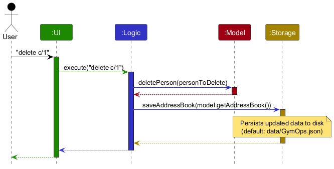
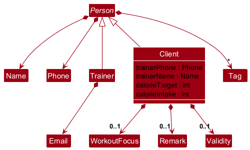
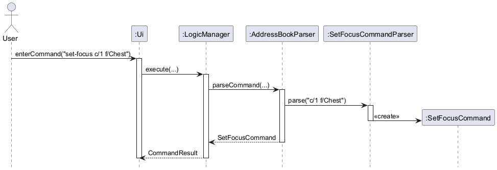
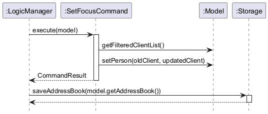
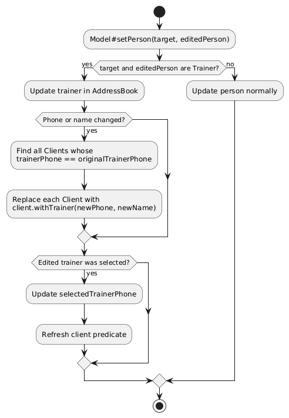
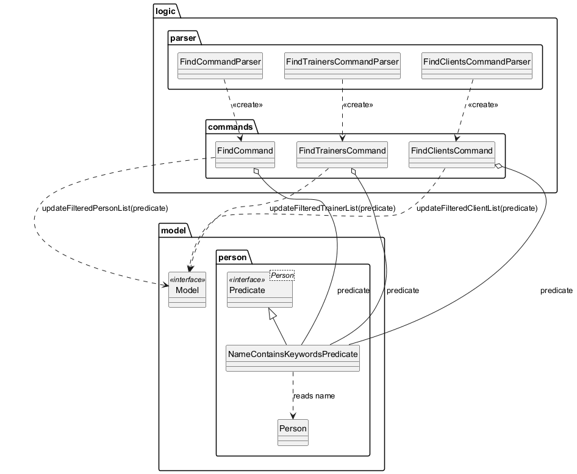
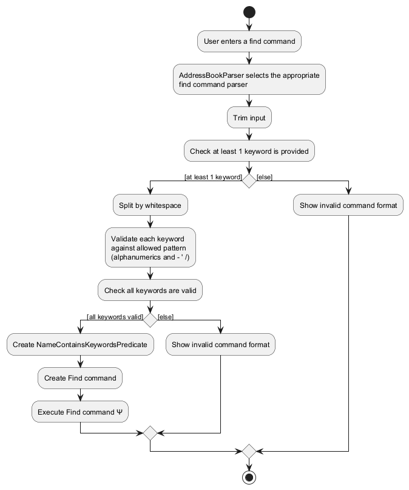
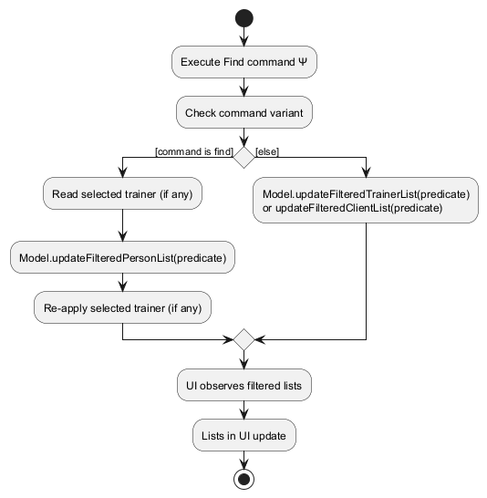
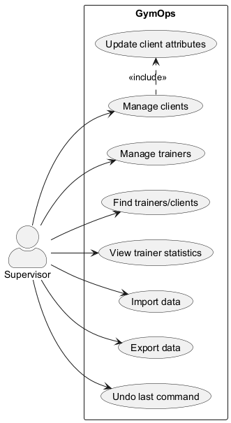

* Table of Contents
{:toc}

--------------------------------------------------------------------------------------------------------------------

## **Acknowledgements**

* This project is based on AddressBook-Level3 by the [SE-EDU initiative](https://se-education.org). The overall architecture (UI/Logic/Model/Storage split), command parsing/execution flow, and JSON storage design were adapted from AB3.
* The structure and some sections/diagrams in this Developer Guide were adapted from the AddressBook-Level3 Developer Guide, then updated to reflect GymOps-specific features and command formats.
* PlantUML usage and conventions were guided by the [se-edu PlantUML tutorial](https://se-education.org/guides/tutorials/plantUml.html).
* The Metro-style JavaFX button CSS in the dark theme is adapted from the JMetro styling example by Pedro Duque Vieira (PixelDuke) as cited in the stylesheet comments.

--------------------------------------------------------------------------------------------------------------------

## **Setting up, getting started**

Refer to the guide [_Setting up and getting started_](SettingUp.md).

:information_source: **Note:** This Developer Guide focuses on GymOps internals (architecture, design, and implementation). Complete the setup guide first if you need build/run instructions.

--------------------------------------------------------------------------------------------------------------------

## **Design**

:bulb: **Tip:** The `.puml` files used to create diagrams are in this document `docs/diagrams` folder. Refer to the [_PlantUML Tutorial_ at se-edu/guides](https://se-education.org/guides/tutorials/plantUml.html) to learn how to create and edit diagrams.

### Architecture

The ***Architecture Diagram*** given above explains the high-level design of the App.

Given below is a quick overview of main components and how they interact with each other.

**Main components of the architecture**

**`Main`** (consisting of classes [src/main/java/seedu/address/Main.java](../src/main/java/seedu/address/Main.java) and [src/main/java/seedu/address/MainApp.java](../src/main/java/seedu/address/MainApp.java)) is in charge of the app launch and shut down.
* At app launch, it initializes the other components in the correct sequence, and connects them up with each other.
* At shut down, it shuts down the other components and invokes cleanup methods where necessary.

The bulk of the app's work is done by the following four components:

* [**`UI`**](#ui-component): The UI of the App.
* [**`Logic`**](#logic-component): The command executor.
* [**`Model`**](#model-component): Holds the data of the App in memory.
* [**`Storage`**](#storage-component): Reads data from, and writes data to, the hard disk.

[**`Commons`**](#common-classes) represents a collection of classes used by multiple other components.

:bulb: **Tip:** When adding a new feature, keep `UI` as a thin presenter. Put parsing in `logic.parser`, business rules/state changes in `logic`/`model`, and persistence concerns in `storage`.

**How the architecture components interact with each other**

The *Sequence Diagram* below shows how the components interact with each other for the scenario where the user issues the command `delete c/1`.

Each of the four main components (also shown in the diagram above),

* defines its *API* in an `interface` with the same name as the Component.
* implements its functionality using a concrete `{Component Name}Manager` class (which follows the corresponding API `interface` mentioned in the previous point.

For example, the `Logic` component defines its API in the `Logic.java` interface and implements its functionality using the `LogicManager.java` class which follows the `Logic` interface. Other components interact with a given component through its interface rather than the concrete class (reason: to prevent outside component's being coupled to the implementation of a component), as illustrated in the (partial) class diagram below.

The sections below give more details of each component.

### UI component

The **API** of this component is specified in [src/main/java/seedu/address/ui/Ui.java](../src/main/java/seedu/address/ui/Ui.java)

The UI consists of a `MainWindow` that is made up of parts e.g.`CommandBox`, `ResultDisplay`, `PersonListPanel`, `StatusBarFooter` etc. All these, including the `MainWindow`, inherit from the abstract `UiPart` class which captures the commonalities between classes that represent parts of the visible GUI.

The `UI` component uses the JavaFx UI framework. The layout of these UI parts are defined in matching `.fxml` files that are in the `src/main/resources/view` folder. For example, the layout of the [src/main/java/seedu/address/ui/MainWindow.java](../src/main/java/seedu/address/ui/MainWindow.java) is specified in [src/main/resources/view/MainWindow.fxml](../src/main/resources/view/MainWindow.fxml)

:warning: **Warning:** JavaFX UI state should be mutated on the JavaFX Application Thread. Avoid updating observable lists or UI-bound properties from background threads.

The `UI` component,

* executes user commands using the `Logic` component.
* listens for changes to `Model` data so that the UI can be updated with the modified data.
* keeps a reference to the `Logic` component, because the `UI` relies on the `Logic` to execute commands.
* depends on some classes in the `Model` component, as it displays `Person` object residing in the `Model`.

### Logic component

**API** : [src/main/java/seedu/address/logic/Logic.java](../src/main/java/seedu/address/logic/Logic.java)

Here's a (partial) class diagram of the `Logic` component:

The sequence diagram below illustrates the interactions within the `Logic` component, taking the `execute("delete c/1")` API call as an example.

:information_source: **Note:** The lifeline for `DeleteCommandParser` should end at the destroy marker (X) but due to a limitation of PlantUML, the lifeline continues till the end of diagram.

How the `Logic` component works:

1. When `Logic` is called upon to execute a command, it is passed to an `AddressBookParser` object which in turn creates a parser that matches the command (e.g., `DeleteCommandParser`) and uses it to parse the command.
1. This results in a `Command` object (more precisely, an object of one of its subclasses e.g., `DeleteCommand`) which is executed by the `LogicManager`.
1. The command can communicate with the `Model` when it is executed (e.g. to delete a person). 
   Note that although this is shown as a single step in the diagram above (for simplicity), in the code it can take several interactions (between the command object and the `Model`) to achieve.
1. The result of the command execution is encapsulated as a `CommandResult` object which is returned back from `Logic`.

Here are the other classes in `Logic` (omitted from the class diagram above) that are used for parsing a user command:

How the parsing works:
* When called upon to parse a user command, the `AddressBookParser` class creates an `XYZCommandParser` (`XYZ` is a placeholder for the specific command name e.g., `AddCommandParser`) which uses the other classes shown above to parse the user command and create a `XYZCommand` object (e.g., `AddCommand`) which the `AddressBookParser` returns back as a `Command` object.
* All `XYZCommandParser` classes (e.g., `AddCommandParser`, `DeleteCommandParser`, ...) inherit from the `Parser` interface so that they can be treated similarly where possible e.g, during testing.

:bulb: **Tip:** Adding a new CLI command typically involves:

1. Adding a new `XYZCommand` (plus `MESSAGE_USAGE`) under `logic.commands`.
2. Adding a corresponding `XYZCommandParser` under `logic.parser` (prefer reusing `ArgumentTokenizer` + `ParserUtil`).
3. Registering the command word in `AddressBookParser`.
4. Adding tests for the parser + command execution.

### Model component
**API** : [src/main/java/seedu/address/model/Model.java](../src/main/java/seedu/address/model/Model.java)

The `Model` component,

* stores the address book data i.e., all `Person` objects (which are contained in a `UniquePersonList` object).
* exposes multiple _filtered_ lists (as unmodifiable `ObservableList<Person>`) that the UI can observe:
   * all persons (`Model#getFilteredPersonList()`),
   * trainers only (`Model#getFilteredTrainerList()`), and
   * clients only (`Model#getFilteredClientList()`).
* supports a selected-trainer state (`Model#setSelectedTrainer(...)`) which further refines the displayed client list.
* supports sorting the trainer list (e.g., `stats` updates a comparator used by the trainer list).
* stores a `UserPrefs` object that represents the user’s preferences. This is exposed to the outside as a `ReadOnlyUserPrefs` object.
* does not depend on any of the other three components (as the `Model` represents data entities of the domain, they should make sense on their own without depending on other components)

:warning: **Warning:** Index-based commands must resolve indices from the correct *currently displayed* filtered list (trainer vs client). When implementing/editing commands, be explicit about which `Model#getFiltered...List()` the index refers to.

:information_source: **Note:** An alternative (arguably, a more OOP) model is given below. It has a `Tag` list in the `AddressBook`, which `Person` references. This allows `AddressBook` to only require one `Tag` object per unique tag, instead of each `Person` needing their own `Tag` objects. 

### Storage component

**API** : [src/main/java/seedu/address/storage/Storage.java](../src/main/java/seedu/address/storage/Storage.java)

The `Storage` component,
* can save both address book data and user preference data in JSON format, and read them back into corresponding objects.
* inherits from both `AddressBookStorage` and `UserPrefsStorage`, which means it can be treated as either one (if only the functionality of only one is needed).
* depends on some classes in the `Model` component (because the `Storage` component's job is to save/retrieve objects that belong to the `Model`)

:warning: **Warning:** Changes to the JSON format are user-data-impacting. If you modify storage/schema (e.g., `JsonAdaptedPerson`), keep backwards-compatibility in mind and update the related tests and documentation.

### Common classes

Classes used by multiple components are in the `seedu.address.commons` package.

--------------------------------------------------------------------------------------------------------------------

## **Implementation**

This section describes some noteworthy details on how certain features are implemented.

### Trainer and client domain model (two-entity system)

GymOps models two concrete entity types:

* `Trainer` (staff member), and
* `Client` (gym member assigned to a trainer).

At the storage and model layers, both are stored in the same collection:

* `AddressBook` maintains a single `UniquePersonList` of `Person` objects.
* `Trainer` and `Client` are subtypes of the abstract base class `Person`.

The UI shows two lists by filtering that single list using `instanceof` checks in `ModelManager`:

* `Model#getFilteredTrainerList()` returns only `Trainer` instances (and may also be sorted, e.g., by `stats`).
* `Model#getFilteredClientList()` returns only `Client` instances, optionally refined by the selected-trainer filter.

:information_source: **Info:** GymOps does not maintain separate trainer/client collections in the model; both lists are views over the same underlying `UniquePersonList<Person>`.

:warning: **Warning:** Phone numbers are globally unique across all persons. GymOps also enforces trainer email uniqueness among trainers.

:bulb: **Tip:** When implementing a command that takes an index, be explicit about which filtered list it indexes into (trainer list vs client list) to avoid subtle UI/index mismatches.

The class diagram below shows the entity hierarchy and the fields each type owns:

#### Identity and uniqueness rules

Uniqueness is enforced by `UniquePersonList` via `Person#isSamePerson(...)` using these rules:

* **Phone uniqueness (global)**: two persons (client or trainer) are considered the “same person” if they share **phone**.
* **Trainer email uniqueness**: two trainers are also considered the “same person” if they share **email**.

These rules affect `add-*` and `edit-*` commands because duplicates are rejected at the `UniquePersonList` level.

#### Representing client assignment to trainers

Each `Client` stores its assigned trainer as a value pair:

* `trainerPhone` (the trainer’s phone), and
* `trainerName` (the trainer’s name).

GymOps does not store a direct object reference from `Client` to a `Trainer` instance. This choice keeps the model simple and makes client cards renderable without extra lookups, but requires explicit consistency handling when trainers change.

:information_source: **Note:** Because assignment is stored as duplicated trainer fields, any future change to trainer identity/assignment representation must also update the consistency rules (load cleanup, edit propagation, and delete constraints) to avoid “dangling assignment” bugs.

#### Keeping the two-entity system consistent

GymOps maintains referential consistency between `Client` and `Trainer` in a few key places:

* **On load (storage)**: after JSON is converted into model objects, GymOps removes any `Client` whose `trainerPhone` does not match any existing `Trainer` phone in the loaded dataset.
   This prevents the app from starting with inconsistent state if the JSON file is manually edited.
* **On trainer edits (model)**: when `Model#setPerson(target, editedPerson)` edits a trainer, `ModelManager` propagates changes by updating every client whose `trainerPhone` matches the original trainer.
   This keeps client assignment labels correct even if the trainer’s phone/name changes.
* **On trainer deletion (logic)**: deleting a trainer is blocked if any client is still assigned to them.
   Users must reassign or delete those clients first.

The sections below (Client attributes, trainer selection filtering, and trainer edit propagation) build on this model.

### Client attributes

GymOps extends the base `Person` model with a `Client` subtype that includes client-specific attributes.

Client-specific attributes include:

* **Assigned trainer**: stored as the trainer's phone and name fields in `Client`.
* **Calorie tracking**: `calorieTarget` (0 means not set) and `calorieIntake`.
* **Workout focus**: a short string containing letters, where words may be separated by single spaces (e.g., `Upper Body`), stored as a `WorkoutFocus` value object.
* **Remark**: free-text operational notes (must be non-empty after trimming), stored as a `Remark` value object.
* **Membership validity**: an optional membership validity date (`YYYY-MM-DD`) that must not be in the past, stored as a `Validity` value object.

These values are stored in the `Client` model and are persisted through `JsonAdaptedPerson`.

#### Implementation

At the model layer, `Client` is a `Person` subtype with additional client-only fields:

* **Assigned trainer**: stored as `trainerPhone` and `trainerName` fields.
* **Calorie tracking**: `calorieTarget` and `calorieIntake` are stored as integers, where `0` means "not set" for `calorieTarget`.
* **Workout focus**: stored as an `Optional<WorkoutFocus>`.
* **Remark**: stored as an `Optional<Remark>`.
* **Membership validity**: stored as an `Optional<Validity>` (ISO-8601 `YYYY-MM-DD`).

`WorkoutFocus` and `Remark` are value objects that encapsulate validation:

* `WorkoutFocus` only allows letters, with optional single spaces between words (`[A-Za-z]+(\\s[A-Za-z]+)*`).
* `Remark` must be non-empty after trimming.

To keep `Client` immutable, each client-only update is implemented using a copy-with style API:

* `Client#withTrainer(...)`
* `Client#withCalorieTarget(...)`
* `Client#withCalorieIntake(...)`
* `Client#withWorkoutFocus(...)`
* `Client#withRemark(...)`
* `Client#withValidity(...)`

:bulb: **Tip:** When adding a new client-only attribute, prefer extending the same pattern (`Optional<ValueObject>` in `Client` + `Client#withX(...)` + `ParserUtil.parseX(...)` + `JsonAdaptedPerson` field) so updates remain localised and testable.

All client-attribute commands follow the same high-level pattern:

1. Resolve the target client from the current `Model#getFilteredClientList()` using the user-provided index.
2. Create an updated `Client` instance using one of the `withX(...)` methods.
3. Replace the old instance via `Model#setPerson(oldClient, updatedClient)`.
4. Persist the updated address book through `Storage` (triggered by `LogicManager`).

Storage is implemented through `JsonAdaptedPerson`, which serialises/deserialises all client-only fields.
For optional fields (`workoutFocus`, `remark`, `validity`), `null` is stored when absent and mapped back to `Optional.empty()` on load.
`JsonAdaptedPerson` also includes a small backward-compatibility fallback that infers the person type when `type` is missing.

#### Command Flow

The following sequence occurs when executing `set-focus c/1 f/Chest`:

1. The supervisor enters `set-focus c/1 f/Chest`.
2. `AddressBookParser` identifies the command word `set-focus`.
3. `SetFocusCommandParser` parses the client index (`c/`) and focus value (`f/`).
4. A `SetFocusCommand` object is created.
5. `LogicManager` executes the command.
6. The command retrieves the client from the filtered client list.
7. `Client#withWorkoutFocus(...)` is called to create an updated `Client`.
8. `Model#setPerson(...)` replaces the old client with the updated client.
9. `LogicManager` saves the updated address book via `Storage#saveAddressBook(...)`.
10. The UI updates because it observes the model’s filtered lists.

The sequence diagram below shows a typical execution flow for `set-focus c/1 f/Chest`:

To keep the text readable, the flow is split into two smaller sequence diagrams.

**Parsing flow**:

**Execution and persistence flow**:

Other client attribute commands follow the same flow, with small differences:

* `edit-client INDEX [cal/CALORIES] [f/FOCUS] [r/REMARK] [v/VALIDITY]` updates multiple client-only fields in one command.
   * For `f/`, `r/`, and `v/`, providing an empty value (e.g., `f/`) clears the corresponding optional field.
* `remark INDEX r/REMARK` updates `Client#remark`.
* `set-calorie-target INDEX cal/CALORIES` updates `Client#calorieTarget`.
* `log-calorie INDEX cal/CALORIES` adds to `Client#calorieIntake` rather than overwriting it.
* `reassign-client CLIENT_INDEX t/TRAINER_INDEX` reads both the filtered client list and filtered trainer list and updates `trainerPhone` + `trainerName`.
* `set-validity INDEX v/YYYY-MM-DD` updates `Client#validity`.

#### Filtering Behaviour

All client-attribute commands resolve the target client based on the **currently displayed client list** (`Model#getFilteredClientList()`).
As a result, the same client can have different indices depending on:

* whether a trainer is currently selected (client list filtering), and
* whether the user has applied `find-clients`.

For `reassign-client`, the `CLIENT_INDEX` is resolved from the displayed client list and the `t/TRAINER_INDEX` is resolved from the displayed trainer list.

:warning: **Warning:** Filtering/selection means indices are *contextual*. A command that looks correct against the full list can target the wrong record if a `find-*` filter or selected-trainer filter is active.

#### Error Handling

GymOps defends at both parsing and execution layers:

* Invalid formats (missing prefixes/arguments) are rejected by the relevant `XYZCommandParser` with a `ParseException`.
* Invalid attribute values are rejected by their value objects (e.g., `WorkoutFocus` rejects non-letter input and disallows multiple consecutive spaces; `Remark` rejects blank remarks).
* Invalid validity dates are rejected by `Validity` (must be a valid date in `YYYY-MM-DD` format and must not be in the past).
* Invalid indices (out of bounds, or pointing at a non-client in the client list) cause the command to throw a `CommandException`.

:information_source: **Note:** Use `ParseException` for malformed input (parser stage) and `CommandException` for domain/semantic failures (execution stage). This keeps error messages consistent and makes testing easier.

#### Usage Scenario

Given below is an example scenario showing how client attributes are updated over time.

Step 1. The supervisor lists clients using `list-clients` (or narrows down to a smaller set using `find-clients`).

Step 2. The supervisor sets the workout focus for the first client using `set-focus c/1 f/Chest`.
GymOps updates the client’s workout focus, persists the change, and the UI updates to show the focus label on that client’s card.

Step 3. The supervisor records an operational note using `remark 1 r/Recovering from ACL surgery`.
GymOps overwrites any existing remark and updates the client card.

Step 4. The supervisor sets a daily calorie target using `set-calorie-target 1 cal/2000`.
GymOps updates the target and persists the change.

Step 5. The supervisor logs calorie intake throughout the day using `log-calorie 1 cal/500`.
GymOps adds the new amount to the existing intake total.

:information_source: **Note:** The current version does not automatically reset intake totals by date.

#### Design Considerations

**Aspect: Representation of optional client-only fields**

* **Option 1 (current choice):** Store workout focus and remark as `Optional<...>`.
   * Pros: Expresses "absent vs present" explicitly and avoids sentinel values.
   * Cons: Slightly more boilerplate at the storage and UI layers.
* **Option 2:** Store empty strings when not set.
   * Pros: Simpler serialisation.
   * Cons: Blurs "unset" vs "set to empty", and makes validation/formatting harder.

**Aspect: Representation of calorie target**

* **Option 1 (current choice):** Use `int calorieTarget` where `0` means "not set".
   * Pros: Lightweight and easy to display without null-handling.
   * Cons: Overloads the meaning of `0` (cannot represent a literal target of 0).
* **Option 2:** Use `OptionalInt` for calorie target.
   * Pros: More semantically precise.
   * Cons: Adds complexity to parsing, serialisation, and UI formatting.

#### Future Improvements

* Reset calorie intake totals by date (e.g., auto-reset at midnight, or store intake logs with timestamps).
* Unify index conventions for client-attribute commands (some commands use `c/INDEX` while others use a plain `INDEX`).
* Consider using a trainer identifier reference (instead of duplicating trainer name + phone) to reduce duplication and simplify long-term maintenance.
* Allow storing past validity dates and visually highlight expired validity dates in the client card.

**UI**:

* `PersonCard` displays client-only labels when present (calorie info + progress bar, workout focus, remark, and membership validity).

### Trainer selection and client list filtering

GymOps displays two lists in the UI: a **trainer list** and a **client list**.

To support “select a trainer → filter clients”, the `Model` exposes:

* `Model#setSelectedTrainer(Trainer)`
* `Model#clearSelectedTrainer()`
* `Model#getSelectedTrainer()`

`ModelManager` stores the selected trainer’s phone (as an `Optional<Phone>`) and uses it to refine the client list predicate. This keeps the filtering logic inside `Model`, while allowing `UI` to remain a thin consumer of observable lists.

In addition to selecting a trainer from the UI list, `list-clients` also participates in this flow:

* `list-clients` (no index) clears any selected trainer and shows all clients.
* `list-clients INDEX` selects the trainer at `INDEX` (from the currently displayed trainer list) and filters the client list to that trainer.

### Trainer edits and assignment consistency

Because `Client` stores its assigned trainer as a `(trainerPhone, trainerName)` pair, GymOps must keep client assignments consistent when a trainer is edited.

#### Implementation

When `Model#setPerson(target, editedPerson)` is called and both `target` and `editedPerson` are trainers, `ModelManager`:

1. Updates the trainer in the address book.
2. Detects whether the trainer’s phone or name changed.
3. If either changed, iterates through all clients whose `trainerPhone` matches the original trainer and updates them using `Client#withTrainer(editedTrainerPhone, editedTrainerName)`.

Additionally, if the edited trainer was the currently selected trainer (used for client list filtering), `ModelManager` updates the stored selected phone to the new value so that the UI remains filtered to the same logical trainer.

The activity diagram below summarises the propagation logic when a trainer is edited:

#### Design Considerations

**Aspect: Storing trainer references inside `Client`**

* **Option 1 (current choice):** Store trainer phone and name directly in the client.
   * Pros: Client cards can display trainer information without additional lookups.
   * Cons: Requires propagation logic when trainers are edited.
* **Option 2:** Store only a trainer identifier and resolve display data on demand.
   * Pros: Avoids duplication and eliminates propagation on trainer edits.
   * Cons: Requires more indirection in UI/model and careful handling of deleted trainers.

### Viewing trainer statistics (`stats`)

`stats` sorts the trainer list by the number of clients assigned to each trainer.

#### Implementation

1. `StatsCommand` refreshes the trainer list to show all trainers.
2. It counts clients per trainer phone by scanning the address book person list.
3. It updates the trainer list sorting comparator so that trainers are ordered by client count (descending), breaking ties by trainer name.

The sorting is implemented using a `SortedList` in the model, so updating the comparator is sufficient for the UI to reflect the new order.

### Import/export

GymOps supports exporting and importing data as JSON.

#### Export

* `export FILE_PATH` uses `JsonAddressBookStorage` with the user-provided file path.
* Storage uses `FileUtil#createIfMissing(...)` to create missing parent directories and the file before writing.
* Any `IOException` is reported back to the user as a command failure message.

#### Import

* `import FILE_PATH` uses `JsonAddressBookStorage` with the user-provided file path.
* If the file is missing, import fails with a “file not found” message.
* If the JSON is invalid or contains invalid values, storage throws a `DataLoadingException` and the command fails with a corresponding message.
* On success, the imported address book replaces the current in-memory address book via `Model#setAddressBook(...)`.

:information_source: **Note:** GymOps persists changes after successful commands (see the next section), so a successful import is also saved into the app’s configured data file immediately after the command completes.

:warning: **Warning:** `import` replaces the in-memory address book. If you want to preserve current data, `export` first.

### Automatic persistence

GymOps follows an “auto-save” approach: after every successful command, `LogicManager` saves the updated address book via `Storage#saveAddressBook(...)`.
This keeps the data file up-to-date without requiring an explicit `save` command.

:information_source: **Note:** Failed commands should not trigger a save. When implementing new commands, ensure you do not mutate model state before validation passes.

### Data file migration and resilience

#### Data path migration

On startup, `MainApp` migrates the data file name from `addressbook.json` to `GymOps.json` (in the same directory) if the preferences still reference the old AB3 default.
This is a one-time compatibility step to smooth the transition from AB3-based data setups.

#### Resilience to missing/corrupted/inconsistent data

* If the data file is missing, GymOps starts with sample data and creates the data file on the next save.
* If the data file is corrupted (invalid JSON or invalid values), GymOps starts with an empty address book.
   Because GymOps persists after successful commands, continuing to use the app may overwrite the original file.
* If the data file is valid JSON but contains inconsistent records (e.g., a client referencing a trainer phone that does not exist), GymOps drops only those inconsistent clients during load.

### Find feature

GymOps provides three search commands:

* `find KEYWORD [MORE_KEYWORDS]...` — filters both the trainer list and client list by name.
* `find-trainers KEYWORD [MORE_KEYWORDS]...` — filters only the trainer list by name.
* `find-clients KEYWORD [MORE_KEYWORDS]...` — filters only the client list by name.

All three commands are **case-insensitive** and use **partial (substring) matching**.

#### Keyword validation

All three `find*` command parsers enforce the same keyword rules:

1. The input must contain at least one keyword (empty input is rejected).
2. Keywords are split by whitespace.
3. Each keyword must match the regex `[\p{Alnum}\-'/]+`.
    * i.e., only letters/digits plus `-`, `'`, `/` are allowed.
    * examples of accepted keywords: `alex`, `tan`, `o'connor`, `upper-body`, `s/o`.
    * examples of rejected keywords: `Bob@`, `Alice!`, `john.doe`.

These constraints keep parsing predictable and ensure that keywords remain unambiguous “tokens”.

#### Implementation

At a high level, all three `find*` commands follow the same flow:

1. `AddressBookParser` identifies the command word (`find`, `find-trainers`, or `find-clients`).
2. The corresponding parser (`FindCommandParser`, `FindTrainersCommandParser`, `FindClientsCommandParser`):
    * trims input,
    * splits it into keywords,
    * validates each keyword (see above), and
    * constructs a `NameContainsKeywordsPredicate`.
3. The command executes and updates the model’s filtered list(s):
    * `find` calls `Model#updateFilteredPersonList(predicate)`.
    * `find-trainers` calls `Model#updateFilteredTrainerList(predicate)`.
    * `find-clients` calls `Model#updateFilteredClientList(predicate)`.

The diagram below shows the main classes involved in the `find*` feature:

The predicate implementation is intentionally simple:

* It converts the person’s full name to lowercase, and checks whether the full name **contains** any keyword (also lowercased).
* Multiple keywords are combined using **OR** semantics (`anyMatch`): a person matches if **any** keyword matches.

The activity diagram below summarises the end-to-end flow for keyword validation and filtering.
To keep the diagram readable, it is split into parsing/validation and execution.

#### Matching semantics

**Partial vs exact**

GymOps uses **partial** matching, implemented as a substring check:

* Searching `find alex` matches `Alex Tan`, `Alexandra Lim`, and also any name that contains `alex` as a substring.

**Case-insensitivity**

* Searching `find aLeX` is equivalent to `find alex`.

**Multiple keywords (OR semantics)**

* Searching `find alex tan` matches a person if their name contains `alex` **or** `tan`.

**No relevance ranking**

GymOps currently does not compute relevance scores (e.g., exact-token vs prefix vs substring) and does not re-rank matches by relevance. Results are shown in the list order after filtering (and may still be affected by any existing list sorting, e.g., the trainer list after `stats`).

#### Interaction with trainer selection

GymOps supports “select trainer → filter clients”. This interacts with searching as follows:

* `find` filters both lists via `updateFilteredPersonList(...)`. Because updating the person list clears the selected trainer internally, `FindCommand` preserves the selection by reading the currently selected trainer before filtering and re-applying it afterwards.
   As a result, if a trainer is selected, the client list remains restricted to that trainer even after `find`.
* `find-clients` updates the client predicate directly. If a trainer is selected, the model’s selection filter is still applied on top of the keyword filter.
* `find-trainers` filters only the trainer list and does not change trainer selection.

#### Usage scenario

Step 1. Supervisor enters `find-clients alex`.

Step 2. `FindClientsCommandParser` validates keywords and creates a `FindClientsCommand` with `NameContainsKeywordsPredicate(["alex"])`.

Step 3. `FindClientsCommand` calls `Model#updateFilteredClientList(...)`.

Step 4. The UI updates automatically and shows only clients whose names contain `alex` (case-insensitive), subject to any active trainer selection filter.

#### Design considerations

**Aspect: Matching strategy**

* **Option 1 (current choice): Partial matching (substring)**
   * Pros: More forgiving and discoverable; users do not need to remember exact full words.
   * Cons: Can return broader matches (potentially more noise).
* **Option 2: Exact token matching**
   * Pros: More precise results.
   * Cons: Less usable for quick lookup; requires the user to type exact words.

**Aspect: Keyword combination**

* **Option 1 (current choice): OR semantics across keywords**
   * Pros: Easy to use; supports “show me anyone matching any of these terms”.
   * Cons: Can return too many results for common keywords.
* **Option 2: AND semantics across keywords**
   * Pros: More targeted results.
   * Cons: More restrictive; may surprise users who expect broader matches.

**Aspect: Result ranking**

* **Option 1 (current choice): No ranking**
   * Pros: Simpler implementation.
   * Cons: Does not prioritise the most relevant matches.
* **Option 2: Relevance ranking (future work)**
   * Pros: Better UX for large datasets by surfacing best matches first.
   * Cons: Requires defining a scoring contract and maintaining it consistently.

--------------------------------------------------------------------------------------------------------------------

## **Documentation, logging, testing, configuration, dev-ops**

* [Documentation guide](Documentation.md)
* [Testing guide](Testing.md)
* [Logging guide](Logging.md)
* [Configuration guide](Configuration.md)
* [DevOps guide](DevOps.md)

--------------------------------------------------------------------------------------------------------------------

## **Appendix: Requirements**

### Product scope

**Target user profile**:

* is a gym supervisor/manager overseeing multiple trainers and their respective client bases
* is tech-savvy, comfortable on desktop, and prefers CLI input over GUI navigation
* types quickly and values rapid data entry for operational coordination
* frequently handles trainer substitutions, client reallocations, and handovers across a shifting weekly schedule
* needs to track high-level client requirements (calorie targets/intake and workout focus) without managing detailed coaching prescriptions

**Value proposition**: reduce the operational burden of managing trainer–client relationships during frequent schedule changes by enabling fast CLI updates and reassignment, while preserving clients’ workout-relevant details (workout focus and calories) for handover.

### User stories

Priorities: High (must have) - `* * *`, Medium (nice to have) - `* *`, Low (unlikely to have) - `*`

Some user stories describe planned/proposed features that may not be implemented in the current version.

| Priority | As a …​                                    | I want to …​                     | So that I can…​                                                        |
| -------- | ------------------------------------------ | ------------------------------ | ---------------------------------------------------------------------- |
| `* * *`  | new supervisor user                        | see usage instructions         | refer to instructions when I forget how to use GymOps                  |
| `* * *`  | supervisor                                 | add a new trainer              | build and maintain my roster of staff                                  |
| `* * *`  | supervisor                                 | list all trainers              | see which trainers are currently employed/registered                    |
| `* * *`  | supervisor                                 | delete a trainer who has no assigned clients | remove trainers who have left the gym                      |
| `* * *`  | supervisor                                 | add a client assigned to a trainer | allocate responsibility for that member                             |
| `* * *`  | supervisor                                 | list all clients (optionally by trainer) | view allocations and a trainer’s current client base            |
| `* * *`  | supervisor                                 | delete a client                | remove members who have cancelled their membership                      |
| `* * *`  | supervisor                                 | reassign a client to another trainer | handle trainer unavailability and schedule changes                 |
| `* * *`  | supervisor                                 | set a client’s membership validity date | track whether a client’s membership is still valid                |
| `* * *`  | supervisor                                 | set a calorie target for a client | record their nutritional goal (e.g., 2500 kcal)                     |
| `* * *`  | supervisor                                 | log a client’s calorie intake  | track whether they are meeting their nutritional goals                  |
| `* * *`  | supervisor                                 | set a workout focus for a client | preserve the right context during handovers                          |
| `* * *`  | supervisor                                 | view a client’s progress summary | see target vs consumed calories and workout focus quickly            |
| `* *`    | supervisor                                 | find trainers/clients by name  | locate their record without scrolling through long lists                |
| `* *`    | supervisor                                 | add a remark to a client       | keep operational notes (e.g., injuries, payment checks)                 |
| `* *`    | supervisor                                 | import data from a JSON file   | restore data from backups or move data between computers                |
| `* *`    | supervisor                                 | export data to a JSON file     | share or archive data outside of the app                                |
| `* *`    | supervisor                                 | clear all entries              | reset the system for a new term/season                                  |
| `*`      | supervisor                                 | undo the last command          | quickly recover from accidental deletions/edits                         |
| `*`      | supervisor                                 | see a time/day-based handover view | know which clients’ requirements are most relevant right now        |

### Use cases

(For all use cases below, the **System** is `GymOps` and the **Actor** is the `supervisor`, unless specified otherwise)

The use case diagram below provides a high-level overview of the main user goals supported by GymOps:

The use cases below cover the user stories in the table above. Use cases that are planned but not implemented in the current version are explicitly labelled.

**Use case: View help**

**MSS**

1. Supervisor requests to view help.
2. GymOps displays a help window with the command summary.

   Use case ends.

**Extensions**

* 2a. The help window is already open.

  * 2a1. GymOps brings the help window to the front.

    Use case ends.

**Use case: Add a trainer**

**MSS**

1. Supervisor issues the command to add a trainer.
2. GymOps validates the input.
3. GymOps creates the trainer and shows it in the trainer list.

   Use case ends.

**Extensions**

* 2a. The input format is invalid (e.g., missing required fields).

  * 2a1. GymOps shows an error message and the correct usage.

    Use case resumes at step 1.

* 2b. The trainer is a duplicate (based on the trainer identity rules).

  * 2b1. GymOps rejects the command and shows an error message.

    Use case resumes at step 1.

**Use case: List all trainers**

**MSS**

1. Supervisor requests to list trainers.
2. GymOps shows the full trainer list.

   Use case ends.

**Use case: Find trainers and/or clients by name**

**MSS**

1. Supervisor issues a find command with one or more keywords.
2. GymOps validates the keywords.
3. GymOps filters the relevant list(s) and shows the results.

   Use case ends.

**Extensions**

* 2a. No keywords are provided.

  * 2a1. GymOps shows an error message and the correct usage.

    Use case resumes at step 1.

* 3a. No entries match the keywords.

  * 3a1. GymOps shows an empty results message.

    Use case ends.

**Use case: Add a client to a trainer**

**MSS**

1.  Supervisor requests to list trainers.
2.  GymOps shows a list of trainers with index numbers.
3.  Supervisor issues the command to add a client, specifying a trainer index.
4.  GymOps validates the input and adds the client assigned to the specified trainer.

    Use case ends.

**Extensions**

* 2a. The trainer list is empty.

   * 2a1. GymOps shows an empty list message.

      Use case resumes at step 1.

* 3a. The trainer index is invalid (not a number, missing, or out of bounds).

   * 3a1. GymOps shows an error message.

      Use case resumes at step 2.

* 3b. The client’s phone number already exists in the system (based on the client identity rules).

   * 3b1. GymOps rejects the command and shows an error message.

      Use case resumes at step 2.

**Use case: List all clients (optionally by trainer)**

**MSS**

1. Supervisor requests to list clients.
2. GymOps shows the full client list.

   Use case ends.

**Extensions**

* 1a. Supervisor requests to list clients for a specific trainer (by providing a trainer index).

  * 1a1. GymOps selects the specified trainer (based on the currently displayed trainer list).
  * 1a2. GymOps shows only clients assigned to that trainer.

    Use case ends.

* 1b. The trainer index is invalid.

  * 1b1. GymOps shows an error message.

    Use case resumes at step 1.

**Use case: Reassign a client to another trainer**

**MSS**

1.  Supervisor requests to list clients.
2.  GymOps shows a list of clients with index numbers.
3.  Supervisor requests to list trainers.
4.  GymOps shows a list of trainers with index numbers.
5.  Supervisor issues the command to reassign a client to a new trainer (e.g., `reassign-client 2 t/1`).
6.  GymOps validates the input and updates the client’s assigned trainer.

   Use case ends.

**Extensions**

* 2a. The client list is empty.

   * 2a1. GymOps shows an empty list message.

      Use case resumes at step 1.

* 5a. The client index is invalid.

   * 5a1. GymOps shows an error message.

      Use case resumes at step 2.

* 5b. The trainer index is invalid.

   * 5b1. GymOps shows an error message.

      Use case resumes at step 4.

**Use case: Edit a trainer**

**MSS**

1. Supervisor requests to list trainers.
2. GymOps shows a list of trainers with index numbers.
3. Supervisor issues the command to edit a trainer’s fields.
4. GymOps validates the input and updates the trainer.
5. GymOps propagates changes to any affected client assignments (where applicable).

   Use case ends.

**Extensions**

* 3a. The trainer index is invalid.

  * 3a1. GymOps shows an error message.

    Use case resumes at step 2.

* 4a. The edit results in a duplicate trainer identity.

  * 4a1. GymOps rejects the edit and shows an error message.

    Use case resumes at step 2.

**Use case: Edit a client (including client-only fields)**

**MSS**

1. Supervisor requests to list clients (or filters clients).
2. GymOps shows a list of clients with index numbers.
3. Supervisor issues the command to edit a client’s fields (including optional client-only fields).
4. GymOps validates the input and updates the client.

   Use case ends.

**Extensions**

* 3a. The client index is invalid for the currently displayed client list.

  * 3a1. GymOps shows an error message.

    Use case resumes at step 2.

* 4a. Any edited value is invalid (e.g., invalid date format, invalid workout focus format, empty remark).

  * 4a1. GymOps rejects the edit and shows an error message.

    Use case resumes at step 2.

**Use case: Update a client’s daily calories (target + intake)**

**MSS**

1.  Supervisor requests to find clients by name.
2.  GymOps shows a list of matching clients.
3.  Supervisor identifies the relevant client and issues a command to set the client’s calorie target.
4.  GymOps updates the client’s calorie target.
5.  Supervisor issues a command to log calorie intake for the same client.
6.  GymOps adds the logged intake to the client’s total intake for the day.

   Use case ends.

**Extensions**

* 2a. No clients match the search keywords.

   * 2a1. GymOps shows an empty results message.

      Use case ends.

* 3a. The calorie target value is invalid (not a number or out of the accepted range).

   * 3a1. GymOps rejects the command and shows an error message.

      Use case resumes at step 2.

* 5a. The logged intake value is invalid (not a positive integer).

   * 5a1. GymOps rejects the command and shows an error message.

      Use case resumes at step 2.

**Use case: Set a client’s workout focus**

**MSS**

1. Supervisor requests to list clients (or filters clients).
2. GymOps shows a list of clients with index numbers.
3. Supervisor issues the command to set the client’s workout focus.
4. GymOps validates the focus string and updates the client.

   Use case ends.

**Extensions**

* 3a. The client index is invalid.

  * 3a1. GymOps shows an error message.

    Use case resumes at step 2.

* 4a. The focus string is invalid.

  * 4a1. GymOps rejects the command and shows an error message.

    Use case resumes at step 2.

**Use case: Add a remark to a client**

**MSS**

1. Supervisor requests to list clients (or filters clients).
2. GymOps shows a list of clients with index numbers.
3. Supervisor issues the command to set the client’s remark.
4. GymOps validates the remark and updates the client.

   Use case ends.

**Extensions**

* 4a. The remark is empty.

  * 4a1. GymOps rejects the command and shows an error message.

    Use case resumes at step 2.

**Use case: Set a client’s membership validity date**

**MSS**

1. Supervisor requests to list clients (or filters clients).
2. GymOps shows a list of clients with index numbers.
3. Supervisor issues the command to set the client’s validity date.
4. GymOps validates the date and updates the client.

   Use case ends.

**Extensions**

* 4a. The date is invalid or is in the past.

  * 4a1. GymOps rejects the command and shows an error message.

    Use case resumes at step 2.

**Use case: View a client’s progress summary**

**MSS**

1. Supervisor requests to list clients (or filters clients).
2. GymOps shows the client list.
3. Supervisor views a client card.
4. GymOps displays the client’s current calorie target/intake (if present) and workout focus (if present).

   Use case ends.

**Extensions**

* 4a. The client has no calorie target set.

  * 4a1. GymOps shows the intake without a target progress indicator (or omits the progress bar).

    Use case ends.

**Use case: View trainer statistics**

**MSS**

1. Supervisor issues the `stats` command.
2. GymOps counts the number of clients assigned to each trainer.
3. GymOps sorts the trainer list by client count (descending, ties broken by trainer name) and displays it.

   Use case ends.

**Extensions**

* 2a. There are no trainers.

  * 2a1. GymOps shows an empty trainer list.

    Use case ends.

**Use case: Delete a client**

**MSS**

1. Supervisor requests to list clients (or filters clients).
2. GymOps shows a list of clients with index numbers.
3. Supervisor issues the command to delete a client by index.
4. GymOps deletes the client.

   Use case ends.

**Extensions**

* 3a. The client index is invalid.

  * 3a1. GymOps shows an error message.

    Use case resumes at step 2.

**Use case: Delete a trainer**

**MSS**

1.  Supervisor requests to list trainers.
2.  GymOps shows a list of trainers with index numbers.
3.  Supervisor issues the command to delete a trainer by index.
4.  GymOps deletes the trainer.

   Use case ends.

**Extensions**

* 3a. The given trainer index is invalid.

   * 3a1. GymOps shows an error message.

      Use case resumes at step 2.

* 4a. The trainer still has assigned clients.

   * 4a1. GymOps rejects the deletion and informs the supervisor to reassign or delete those clients first.

      Use case resumes at step 2.

**Use case: Export data**

**MSS**

1. Supervisor issues the command to export data to a file path.
2. GymOps validates the file path.
3. GymOps writes the current data to the specified JSON file.

   Use case ends.

**Extensions**

* 2a. The file path is invalid.

  * 2a1. GymOps shows an error message.

    Use case resumes at step 1.

* 3a. The file cannot be written (e.g., permission issues).

  * 3a1. GymOps shows an error message.

    Use case resumes at step 1.

**Use case: Import data**

**MSS**

1. Supervisor issues the command to import data from a file path.
2. GymOps validates the file path and attempts to read the file.
3. GymOps validates the JSON content.
4. GymOps replaces the current in-memory data with the imported data.

   Use case ends.

**Extensions**

* 2a. The file does not exist or cannot be read.

  * 2a1. GymOps shows an error message.

    Use case resumes at step 1.

* 3a. The JSON is invalid or contains invalid values.

  * 3a1. GymOps shows an error message.

    Use case resumes at step 1.

**Use case: Clear all entries**

**MSS**

1. Supervisor issues the command to clear all data.
2. GymOps clears all trainers and clients.

   Use case ends.

**Use case: Exit GymOps**

**MSS**

1. Supervisor issues the command to exit.
2. GymOps closes the application.

   Use case ends.

**Use case (planned): Undo the last command**

**MSS**

1. Supervisor issues the command to undo the previous successful command.
2. GymOps restores the application state to what it was before that command.

   Use case ends.

**Extensions**

* 1a. There is no command to undo.

  * 1a1. GymOps shows an error message.

    Use case ends.

**Use case (planned): View a time/day-based handover view**

**MSS**

1. Supervisor requests to view a time/day-based handover overview.
2. GymOps shows a view that surfaces the most time-relevant client requirements.

   Use case ends.

### Non-Functional Requirements

#### Usability

1.  The app should be optimized for a CLI-centric workflow (i.e., common operations are achievable with a small number of commands and without requiring mouse input).
2.  The app should provide clear feedback for both successful and failed commands (e.g., invalid index, invalid value formats).
3.  The app should provide built-in guidance for users (e.g., `help` command listing available commands).

#### Reliability & Data Integrity

1.  Data should be persisted locally and remain intact after restarting the application.
2.  If a command fails validation (e.g., invalid index or invalid input format), the app should not modify the in-memory state and should not corrupt the persisted data.
3.  Import/export should preserve all relevant fields needed for operations (trainer/client identities and client tracking fields) without loss.

#### Performance

1.  For a dataset of up to 100 trainers and 1000 clients, typical commands (e.g., `list`, `find`, `add-trainer`, `add-client`, `delete`, `set-calorie-target`, `log-calorie`, `set-focus`, `remark`) should complete within 1 second on a typical laptop.

#### Portability

1.  The app should work on any mainstream OS (Windows, Linux, macOS) as long as it has Java 17 or above installed.

#### Security & Privacy

1.  The app should not require an internet connection for normal operation.
2.  The app is single-user (supervisor-only) and does not require multiple logins or role-based access control.
3.  All user data should be stored locally on the user’s machine.

### Glossary

* **Supervisor**: The primary (and only) intended user of GymOps; manages allocations and operational coordination.
* **Trainer**: A staff member who trains clients. In GymOps, trainers are the parent entity that clients are assigned to.
* **Client**: A gym member assigned to exactly one trainer at any point in time.
* **Assignment**: The association linking a client to a trainer.
* **Reassignment**: Moving a client’s assignment from one trainer to another.
* **Workout focus**: A high-level muscle group emphasis (e.g., Chest, Back, Legs, Core), not specific exercises.
* **Calorie target**: A client’s intended daily calorie goal (kcal).
* **Calorie intake**: The calories logged as consumed by a client for the day (kcal).
* **Remark**: A free-text operational note about a client (e.g., injuries, payment flags).
* **JSON**: JavaScript Object Notation format used for import/export and local data storage.
* **Mainstream OS**: Windows, Linux, macOS.
* **GymOps**: The name of the application.

--------------------------------------------------------------------------------------------------------------------

## **Appendix: Instructions for Manual Testing**

Given below are instructions to test the app manually.

:information_source: **Note:** These instructions only provide a starting point for testers to work on;
testers are expected to do more *exploratory* testing.

### Launch and shutdown

1. Initial launch

   1. Download the jar file and copy into an empty folder

   1. Double-click the jar file.
      Expected: Shows the GUI with a set of sample trainers and clients. The window size may not be optimum.

      

      :information_source: **Note for testers:**
      * If double-clicking the `.jar` does not launch the app, run it using `java -jar GymOps.jar` from a terminal.

      

      

      :warning: **Warning:** Do not place the app in a write-protected folder (it may fail to save changes).

      

1. Saving window preferences

   1. Resize the window to an optimum size. Move the window to a different location. Close the window.

   1. Re-launch the app by double-clicking the jar file. 
       Expected: The most recent window size and location is retained.

   1. Additional test ideas (optional):
      * Launch the app from command line using different working directories.
      * Verify that closing the app does not create error dialogs.

### Listing and filtering trainers/clients

1. Listing all trainers and clients

   1. Test case: `list` 
      Expected: Any active filtering is cleared and all trainers/clients are shown again.

   1. Test case: `list-trainers` 
      Expected: Any active trainer filtering (e.g., after `find-trainers`) is cleared and all trainers are shown.

   1. Test case: `list-clients` 
      Expected: Any active client filtering (e.g., after `find-clients` or selecting a trainer) is cleared and all clients are shown.

1. Filtering clients by selecting a trainer

   1. Prerequisites: Ensure there is at least one trainer with at least one assigned client.

   1. Test case: `list-clients 1` 
      Expected: Trainer at index 1 is selected and the displayed client list shows only clients assigned to that trainer.

   1. Test case: `list-clients` 
      Expected: Trainer selection is cleared and the displayed client list shows all clients again.

### Editing trainers/clients

1. Editing a trainer

   1. Prerequisites: List trainers using `list-trainers` and note a trainer that has assigned clients.

   1. Test case: `edit-trainer 1 n/Alex Tan` 
      Expected: Trainer at index 1 shows the updated name.

   1. Test case: `edit-trainer 1 p/99998888` 
      Expected: Trainer at index 1 shows the updated phone.
      Also expected: Clients previously assigned to this trainer remain assigned (their stored trainer reference is updated to match the edited trainer).

1. Editing a client (including clearing optional fields)

   1. Prerequisites: List clients using `list-clients`.

   1. Test case: `edit-client 1 n/Bob Lim p/98765432 t/1 cal/2000 f/Upper Body r/Note v/2027-01-01` 
      Expected: Client at index 1 shows updated details (including the optional fields).

   1. Test case: `edit-client 1 f/ r/ v/` 
      Expected: Client at index 1 has workout focus, remark, and validity cleared (removed from the client card display).

   1. Other incorrect edit commands to try: `edit-trainer`, `edit-client`, `edit-client x n/Alice`, `edit-client 1 v/2000-01-01` 
      Expected: Error shown indicating invalid command format or invalid values.

### Deleting a trainer/client

1. Deleting a trainer or client while the corresponding list is being shown

   1. Prerequisites: List entries using `list-trainers` and/or `list-clients`. Ensure there are multiple entries in the list.

   

   :warning: **Warning (trainer deletion constraint):**
   * GymOps will reject deleting a trainer who still has assigned clients.
   * For the “successful delete trainer” test case below, pick a trainer with no assigned clients.

   

   1. Test case: `delete t/1` 
      Expected: Trainer at index 1 is deleted from the trainer list. Details of the deleted trainer shown in the status message.

   1. Test case: `delete-trainer 1` 
      Expected: Same as `delete t/1`.

   1. Test case: `delete c/1` 
      Expected: Client at index 1 is deleted from the client list. Details of the deleted client shown in the status message.

   1. Test case: `delete-client 1` 
      Expected: Same as `delete c/1`.

   1. Test case: `delete t/1` (where trainer at index 1 still has active clients) 
      Expected: Trainer is not deleted. Error shown: `Cannot delete trainer: they still have active clients.`

   1. Test case: `delete t/0` 
      Expected: No entry is deleted. Error details shown in the status message.

   1. Other incorrect delete commands to try: `delete`, `delete x`, `delete t/x`, `delete c/x`, `delete t/999` (where the index is larger than the list size) 
      Expected: Similar to previous.

1. Additional test ideas (optional):
   * Delete a client after filtering the client list (e.g., after `find-clients ...`).
   * Delete a trainer after filtering the trainer list (e.g., after `find-trainers ...`).

### Finding trainers/clients

1. Finding trainers by name

   1. Prerequisites: List all trainers using `list-trainers`.

   1. Test case: `find-trainers alex david` 
      Expected: Only trainers whose names contain `alex` or `david` are shown.

   1. Test case: `find-trainers Bob@` 
      Expected: Error shown indicating invalid command format (usage for `find-trainers` is shown).

1. Finding clients by name

   1. Prerequisites: List all clients using `list-clients`.

   1. Test case: `find-clients alex david` 
      Expected: Only clients whose names contain `alex` or `david` are shown.

1. Returning to full trainer/client list

   1. Prerequisites: Run any successful `find-trainers` or `find-clients` command.

   1. Test case: `list-trainers` (after `find-trainers`) or `list-clients` (after `find-clients`) 
      Expected: All trainers/clients are shown again.

### Adding trainers/clients

1. Adding a trainer

   1. Test case: `add-trainer n/Alex Tan p/91234567 e/alex@example.com` 
      Expected: A new trainer appears in the trainer list.

1. Adding a client

   1. Prerequisites: Ensure there is at least one trainer in the displayed trainer list.

   1. Test case: `add-client n/Bob Lim p/98765432 t/1 v/2026-12-31` 
      Expected: A new client appears in the client list and is assigned to trainer #1.

### Reassigning a client

1. Reassigning a client to a different trainer

   1. Prerequisites: Ensure there are at least 2 trainers and at least 1 client in the displayed lists.

   1. Test case: `reassign-client 1 t/2` 
      Expected: Client at index 1 shows their trainer updated to trainer #2.

### Calorie tracking

1. Setting a calorie target

   1. Prerequisites: Ensure the displayed client list contains at least one client.

   1. Test case: `set-calorie-target 1 cal/2000` 
      Expected: The client card shows a calorie target (and a progress bar).

1. Logging calorie intake

   1. Prerequisites: Ensure the displayed client list contains at least one client.

   1. Test case: `log-calorie 1 cal/500` 
      Expected: The client card shows an updated calorie intake total.

### Setting workout focus

1. Setting workout focus for a client

   1. Prerequisites: Ensure the displayed list contains at least one client.

   1. Test case: `set-focus c/1 f/Chest` 
      Expected: The client at index 1 shows workout focus `Chest`.

   1. Test case: `set-focus c/1 f/Chest1` 
      Expected: Error shown: `Focus string must only contain letters, and words may be separated by single spaces (e.g., Upper Body).`

### Adding remarks

1. Adding a remark to a client

   1. Prerequisites: Ensure the displayed list contains at least one client.

   1. Test case: `remark 1 r/Recovering from ACL surgery` 
      Expected: The client at index 1 shows the remark.

   1. Test case: `remark 1 r/` 
      Expected: Error shown: `Remark cannot be empty.`

### Setting membership validity

1. Setting a membership validity date for a client

   1. Prerequisites: Ensure the displayed client list contains at least one client.

   1. Test case: `set-validity 1 v/2026-12-31` 
      Expected: The client card shows the updated validity date.

   1. Test case: `set-validity 1 v/2026-13-40` 
      Expected: Error shown indicating the date must be in `YYYY-MM-DD` format.

   1. Test case: `set-validity 1 v/2000-01-01` 
      Expected: Error shown: `Validity date must not be in the past.`

### Viewing trainer statistics

1. Viewing statistics

   1. Test case: `stats` 
      Expected: The trainer list is sorted by client count (descending) and a summary is shown.

### Importing/exporting data

1. Exporting

   1. Test case: `export data/export.json` 
      Expected: A success message is shown and the JSON file is created.

   1. Test case: `export data/nested/export.json` (where `data/nested/` does not exist yet) 
      Expected: A success message is shown and the parent directories are created.

   1. Other incorrect export commands to try: `export`, `export ..`, `export :` 
      Expected: Error shown indicating invalid command format or invalid file path.

1. Importing

   1. Prerequisites: Ensure there is an existing exported file (e.g., from the previous step).

   1. Test case: `import data/export.json` 
      Expected: A success message is shown and the displayed data matches the imported file.

   1. Test case: `import data/does-not-exist.json` 
      Expected: Error shown indicating the file cannot be found/read.

   1. Test case: `import data/invalid.json` (prepare by creating a file with invalid JSON)
      Expected: Error shown indicating the file cannot be imported.

### Clearing data, help, and exit

1. Clearing all data

   1. Test case: `clear` 
      Expected: All trainers and clients are removed from the lists.

1. Viewing help

   1. Test case: `help` 
      Expected: A help window appears showing the command summary.

1. Exiting the app

   1. Test case: `exit` 
      Expected: The application window closes.

### Saving data

1. Dealing with missing/corrupted data files

   1. Missing file

      1. Prerequisites: Close the app.
      1. Delete the data file at `data/GymOps.json`.
      1. Launch the app.
         Expected: App starts normally and the data file is re-created with sample trainers/clients.

   1. Corrupted file

      1. Prerequisites: Close the app.
      1. Open `data/GymOps.json` and replace the contents with invalid JSON (e.g., `{`).
      1. Launch the app.
         Expected: App starts normally with an empty address book.

   1. Inconsistent (but valid) file

      1. Prerequisites: Close the app.
      1. Edit `data/GymOps.json` so that a `client` references a `trainerPhone` that does not exist in the file.
      1. Launch the app.
         Expected: App starts normally and only the inconsistent client entries are removed during load.

1. Additional test ideas (optional):
   * Verify that data persists after adding/editing/deleting trainers/clients and restarting the app.

--------------------------------------------------------------------------------------------------------------------

## **Appendix: Effort**

GymOps is built on top of the AddressBook-Level3 (AB3) codebase. This allowed the team to reuse and adapt foundational scaffolding (UI/Logic/Model/Storage layers, command parsing framework, JSON persistence patterns, and basic testing infrastructure) and focus effort on GymOps-specific workflows.

### Difficulty & Challenges

* **Two list-centric entity types**: GymOps manages both trainers and clients as first-class entities, which increases complexity around filtering, index-based commands, and keeping UI lists consistent.
* **Cross-list operations**: Commands such as `reassign-client` and `edit-client ... t/TRAINER_INDEX` resolve indices from different displayed lists, so correctness depends on clearly-defined “index is based on the current filtered list” behavior.
* **Data integrity constraints**: Clients are assigned to exactly one trainer, and deleting trainers must respect this constraint (e.g., reject deletion if the trainer still has active clients).
* **Persistence and compatibility**: Import/export and JSON storage need to persist all relevant fields, handle optional client attributes, and remain resilient to malformed or inconsistent data.
* **Documentation accuracy**: Because behavior depends on filtered lists and selection state (e.g., `list-clients INDEX` selecting a trainer), documenting usage precisely required careful alignment with the implementation.

### Effort & Achievements

* Implemented client-only attributes (calorie tracking, workout focus, remark, membership validity) end-to-end across parsing, model updates, storage, and UI display.
* Standardized client updates using an immutable “copy-with” pattern (`Client#withX(...)` + `Model#setPerson(...)`) to keep changes localized and predictable.
* Added trainer selection and client-list filtering so supervisors can drill down to a specific trainer’s clients.
* Implemented JSON export/import to support data portability and backup workflows.
* Maintained a CLI-centric UX where common workflows remain efficient even under filtered lists.

--------------------------------------------------------------------------------------------------------------------

## **Planned Enhancements**

Team size: 5

1. Allow storing past membership validity dates and visually highlight expired validity dates in the client card.
2. Add a `c/` index prefix to client-attribute commands that currently accept a plain `INDEX`, so that all client-attribute commands uniformly require `c/INDEX` instead of a bare index number.
3. Improve `delete` failure messages to be more specific about the failed target (trainer/client) and failure reason (e.g., trainer still has assigned clients).
4. Improve `import` error reporting to pinpoint which field/entry is invalid (instead of a generic “failed to import”).
5. Improve `export`/`import` UX by suggesting a correct relative path when users provide an invalid one.
6. Improve trainer-selection filtering UX by clearly indicating when the client list is filtered by a selected trainer (and how to return to the full list).
7. Improve `stats` output to explicitly display the computed client counts per trainer in the command result message (in addition to sorting the list).
8. Improve calorie tracking by optionally resetting calorie intake totals by date (while preserving a simple “today’s total” UX).
9. Improve robustness of list-scoped commands under dynamic list changes by providing clearer guidance when indices become invalid after filtering.
