GymOps is a **desktop application for gym managers** to manage trainers and their clients. It is optimised for users who prefer a **Command Line Interface (CLI)** while still offering the benefits of a **Graphical User Interface (GUI)**.

---

## Introduction

### Who this guide is for

This guide is written for **gym managers and administrators** who want a fast, keyboard-driven way to manage their gym's roster. GymOps is designed for users comfortable with typing commands and working with indexed lists.

**We assume you:**
- Can open and use a terminal or command prompt
- Are comfortable typing commands with parameters
- Have Java 17 or above installed, or are able to install it
- Have basic familiarity with indexed lists (e.g. "the 2nd item in a list")

### How to use this guide

- **New to GymOps?** Start with [Quick Start](#quick-start) for installation and a first-use walkthrough.
- **Looking for a specific command?** Jump to [Features](#features) or the [Command Summary](#command-summary) at the end.
- **Having trouble?** Check [Known Issues](#known-issues) or [FAQ](#faq).

**Table of Contents**
- [Introduction](#introduction)
  - [Who this guide is for](#who-this-guide-is-for)
  - [How to use this guide](#how-to-use-this-guide)
- [Quick Start](#quick-start)
- [Features](#features)
  - [Viewing help](#viewing-help-help)
  - [Adding a trainer](#adding-a-trainer-add-trainer)
  - [Adding a client](#adding-a-client-add-client)
  - [Reassigning a client](#reassigning-a-client-reassign-client)
  - [Listing all persons](#listing-all-persons-list)
  - [Listing all trainers](#listing-all-trainers-list-trainers)
  - [Listing all clients](#listing-all-clients-list-clients)
  - [Viewing trainer statistics](#viewing-trainer-statistics-stats)
  - [Viewing a trainer's clients](#viewing-a-trainers-clients)
  - [Finding persons](#finding-persons-find)
  - [Finding trainers](#finding-trainers-find-trainers)
  - [Finding clients](#finding-clients-find-clients)
  - [Setting a calorie target](#setting-a-calorie-target-set-calorie-target)
  - [Logging calorie intake](#logging-calorie-intake-log-calorie)
  - [Setting a workout focus](#setting-a-workout-focus-set-focus)
  - [Adding a remark](#adding-a-remark-remark)
  - [Setting a membership validity](#setting-a-membership-validity-set-validity)
  - [Deleting a person](#deleting-a-person-delete)
  - [Deleting a client](#deleting-a-client-delete-client)
  - [Deleting a trainer](#deleting-a-trainer-delete-trainer)
  - [Exporting data](#exporting-data-export)
  - [Importing data](#importing-data-import)
  - [Clearing all data](#clearing-all-data-clear)
  - [Exiting GymOps](#exiting-gymops-exit)
  - [Saving data](#saving-data)
  - [Editing the data file](#editing-the-data-file)
- [FAQ](#faq)
- [Known Issues](#known-issues)
- [Command Summary](#command-summary)

---

## Quick start

1. Ensure you have **Java 17 or above** installed on your computer.

   **Mac users:** Install the precise JDK version prescribed [here](https://se-education.org/guides/tutorials/javaInstallationMac.html).

1. Download the latest `.jar` file from the project's release page.

1. Copy the file to the folder you want to use as the _home folder_ for GymOps.

1. Open a terminal, `cd` into the folder containing the `.jar` file, and run:

   ```
   java -jar YOUR_FILE_NAME.jar
   ```

   The GymOps window will appear within a few seconds, pre-loaded with sample data.

   

   The window is split into two panels: **Trainers** (left) and **Clients** (right). Each panel shows a scrollable list of cards. Enter commands in the command box at the bottom and press **Enter** to execute them.

1. Try the following commands to get started:

   | Step | Command | What it does |
   |------|---------|-------------|
   | 1 | `list-trainers` | View all trainers |
   | 2 | `add-trainer n/John Doe p/98765432 e/johndoe@example.com` | Add a new trainer |
   | 3 | `list-trainers` | Confirm the trainer was added |
   | 4 | `add-client n/Alice Lim p/81234567 t/1 [v/2028-09-09]` | Assign a client to trainer #1 |
   | 5 | `find-clients Alice` | Search for the client you just added |
   | 6 | `delete-client 1` | Delete the 1st client in the current list |
   | 7 | `clear` | Delete all data |
   | 8 | `exit` | Exit the app |

1. Refer to [Features](#features) for the full details of each command.

---

## Features

<div markdown="block" class="alert alert-info">

**:information_source: Notes about the command format:**

- Words in `UPPER_CASE` are parameters you supply. e.g. in `add-trainer n/NAME`, replace `NAME` with the actual name: `add-trainer n/John Doe`.
- Items in square brackets are optional. e.g. `find KEYWORD [MORE_KEYWORDS]` can be used as `find alice` or `find alice bob`.
- Parameters can be in any order. e.g. `n/NAME p/PHONE_NUMBER` and `p/PHONE_NUMBER n/NAME` are both valid.
- Extraneous parameters for commands that take no parameters (such as `help`, `list`, `exit`, and `clear`) will be ignored.
- An `INDEX` refers to the number shown in the **currently displayed list**, not the full unfiltered list.
- GymOps displays **two lists**: **Trainers** (left) and **Clients** (right). Trainer-related indexes refer to the trainer list; client-related indexes refer to the client list.
- If you are using a PDF version of this document, be careful when copying commands that span multiple lines, as spaces around line breaks may be lost.

</div>

### Viewing help: `help`

Opens the **Help Window**.

The Help Window contains:
- a link to the online User Guide (with a button to copy the URL), and
- a quick command summary.

If the Help Window is already open, running `help` will focus the existing window.

Format: `help`

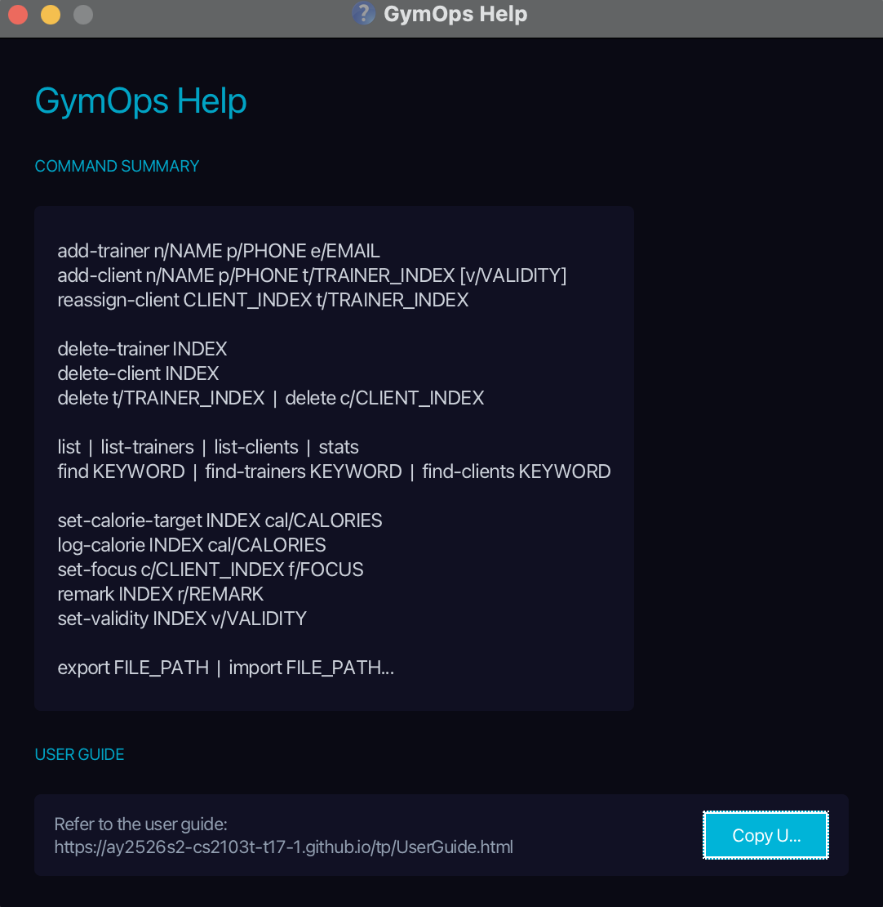

---

### Adding a trainer: `add-trainer`

Adds a new trainer to GymOps.

Format: `add-trainer n/NAME p/PHONE_NUMBER e/EMAIL`

Examples:
* `add-trainer n/John Doe p/98765432 e/johndoe@example.com`

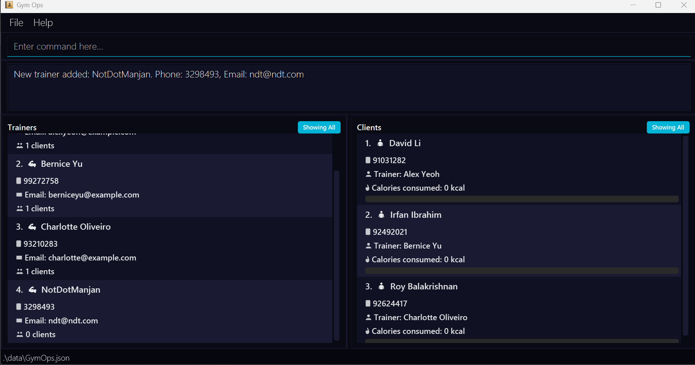

---

### Adding a client: `add-client`

Adds a new client and assigns them to an existing trainer.

Format: `add-client n/NAME p/PHONE_NUMBER t/TRAINER_INDEX [v/VALIDITY]`

* `TRAINER_INDEX` must refer to a trainer visible in the **current trainer list**.
* `VALIDITY` is an optional field must be a valid date in the format `YYYY-MM-DD`.

<div markdown="span" class="alert alert-warning">:exclamation: **Caution:** If the trainer list is filtered (e.g. after a `find-trainers` command), `TRAINER_INDEX` refers to the filtered results. Run `list-trainers` first to assign by the full list.</div>

<div markdown="span" class="alert alert-info">:bulb: **Tip:** Run `list-trainers` to confirm the correct trainer index before adding a client.</div>

Examples:
* `add-client n/Alice Lim p/81234567 t/1` — adds Alice Lim and assigns her to the 1st trainer in the list.
* `add-client n/Alice Lim p/81234567 t/1 v/2028-09-09` — adds Alice Lim, assigns her to the 1st trainer, and sets her membership validity to 2028-09-09.

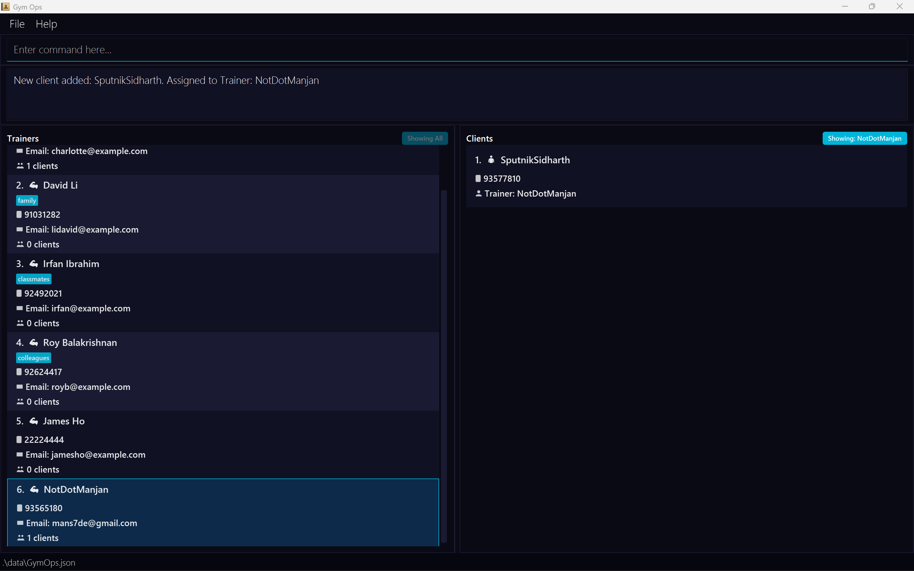

---

### Reassigning a client: `reassign-client`

Reassigns an existing client to a different trainer. All client data (calorie target, intake, workout focus, remark) is preserved.

Format: `reassign-client CLIENT_INDEX t/TRAINER_INDEX`

* `CLIENT_INDEX` must refer to a client in the **client list**.
* `TRAINER_INDEX` must refer to a trainer visible in the **current trainer list**.

<div markdown="span" class="alert alert-warning">:exclamation: **Caution:** If either list is filtered, indexes refer to the filtered results. Run `list` first to reassign using the full lists.</div>

Examples:
* `reassign-client 2 t/1` — reassigns the 2nd client to the 1st trainer.

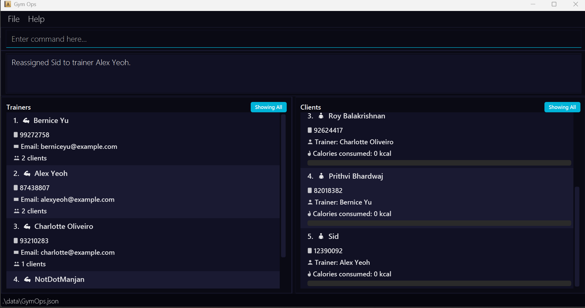

---

### Listing all persons: `list`

Shows all trainers and all clients.

This command resets both lists to show all entries by:
- clearing any active `find` filters, and
- clearing any trainer selection made via the GUI (i.e. if you clicked a trainer to filter clients).

Format: `list`

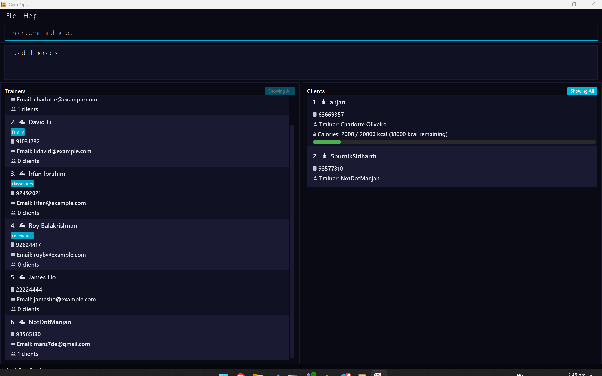

---

### Listing all trainers: `list-trainers`

Shows all trainers in GymOps. Clears any active trainer filter.

Format: `list-trainers`

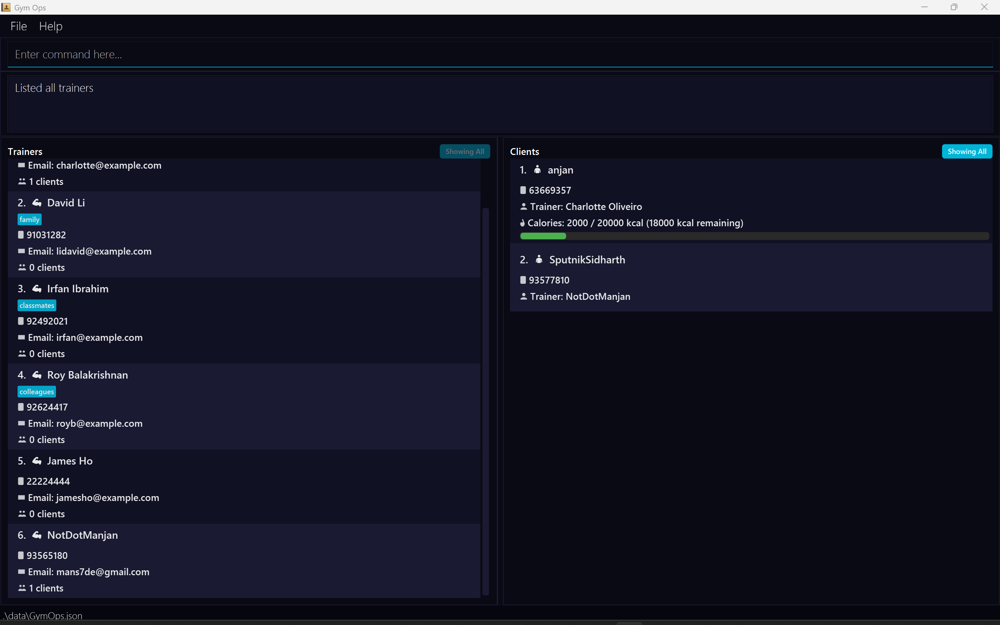

---

### Listing all clients: `list-clients`

Shows all clients in GymOps. Clears any active client filter, including filters applied by clicking a trainer card.

Format: `list-clients`


<div markdown="span" class="alert alert-info">:bulb: **Tip:** After filtering clients by trainer (via the GUI), run `list-clients` to return to the full client list.</div>

---

### Viewing trainer statistics: `stats`

Shows all trainers in GymOps, sorted by the number of clients they have in descending order. Trainers with the same number of clients will be sorted alphabetically by name.

Format: `stats`

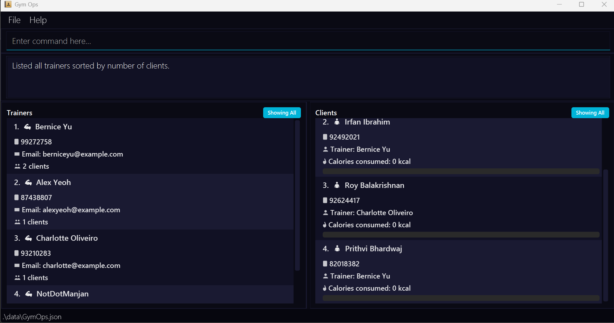

---

### Viewing a trainer's clients

Click on any trainer card in the **Trainers** list to filter the **Clients** list to show only that trainer's assigned clients.

To clear the filter, click the **Showing All** link above the client list, or run `list`.

---

### Finding persons: `find`

Finds trainers and clients whose names contain any of the given keywords.

Format: `find KEYWORD [MORE_KEYWORDS]`

* The search is case-insensitive. e.g. `hans` matches `Hans`.
* The order of keywords does not matter. e.g. `Hans Bo` matches `Bo Hans`.
* Only full words are matched. e.g. `Han` does not match `Hans`.
* Each keyword must be alphanumeric. e.g. `Bob123` is valid; `Bob@` is not.
* Results include persons matching **at least one** keyword (OR search).
* Run `list` to return to the full list after searching.

<div markdown="span" class="alert alert-info">:bulb: **Tip:** Use `find-trainers` or `find-clients` to search within a specific list.</div>

Examples:
* `find John` — returns `john`, `John Doe`
* `find alex david` — returns `Alex Yeoh`, `David Li`

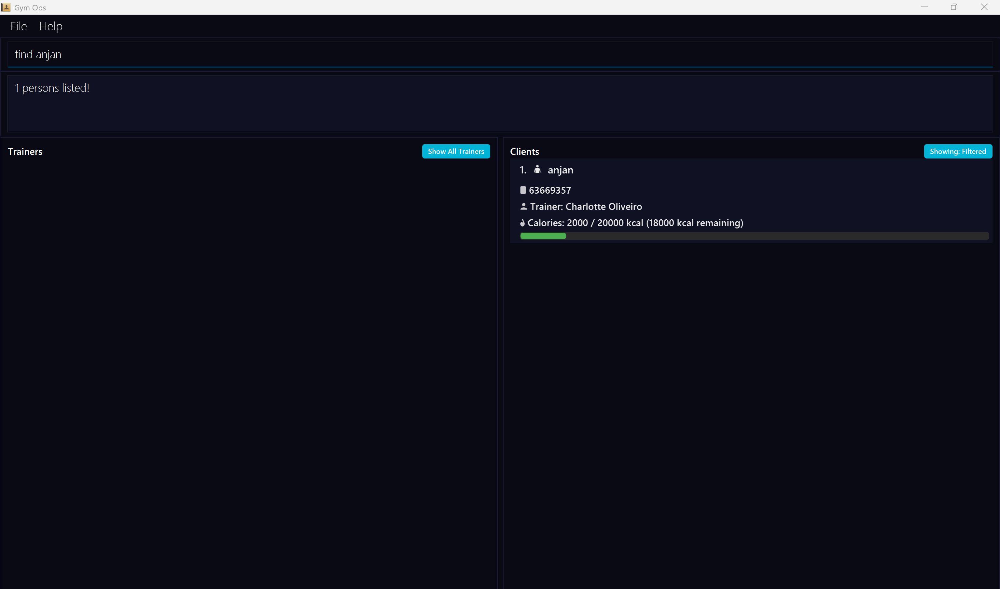

---

### Finding trainers: `find-trainers`

Finds trainers whose names contain any of the given keywords.

Format: `find-trainers KEYWORD [MORE_KEYWORDS]`

* The search is case-insensitive and matches full words only.
* Run `list-trainers` to return to the full trainer list after searching.

Examples:
* `find-trainers John` — returns all trainers with "John" in their name.

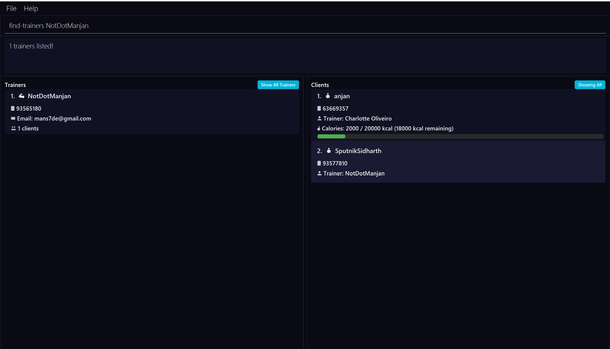

---

### Finding clients: `find-clients`

Finds clients whose names contain any of the given keywords.

Format: `find-clients KEYWORD [MORE_KEYWORDS]`

* The search is case-insensitive and matches full words only.
* Each keyword must be alphanumeric. e.g. `Alice123` is valid; `Alice@` is not.
* Results include clients matching **at least one** keyword (OR search).
* Run `list-clients` to return to the full client list after searching.

Examples:
* `find-clients Alice` — returns all clients with "Alice" in their name.
* `find-clients Alice Bob` — returns all clients with "Alice" or "Bob" in their name.

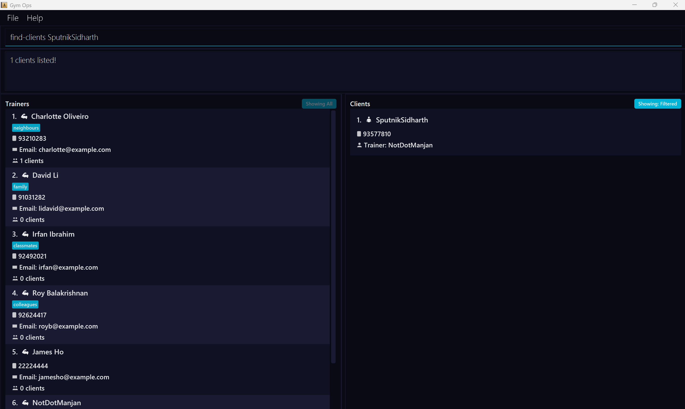

---

### Setting a calorie target: `set-calorie-target`

Sets the daily calorie target for a client.

Format: `set-calorie-target INDEX cal/CALORIES`

* `INDEX` must refer to a client in the **client list**.
* `CALORIES` must be a positive integer.

Examples:
* `set-calorie-target 1 cal/2400` — sets a 2400-calorie daily target for the 1st client.

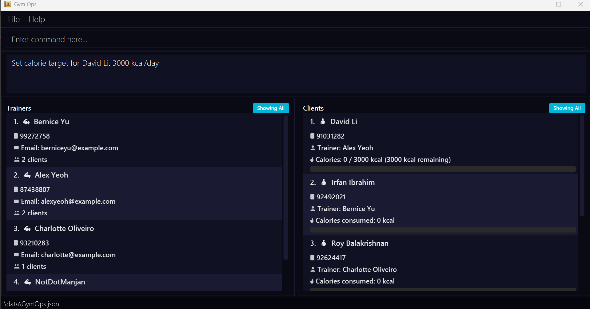

---

### Logging calorie intake: `log-calorie`

Logs calorie intake for a client. Calories are added to the client's existing daily intake.

Format: `log-calorie INDEX cal/CALORIES`

* `INDEX` must refer to a client in the **client list**.
* `CALORIES` must be a positive integer.

Examples:
* `log-calorie 1 cal/1500` — adds 1500 calories to the 1st client's daily intake.

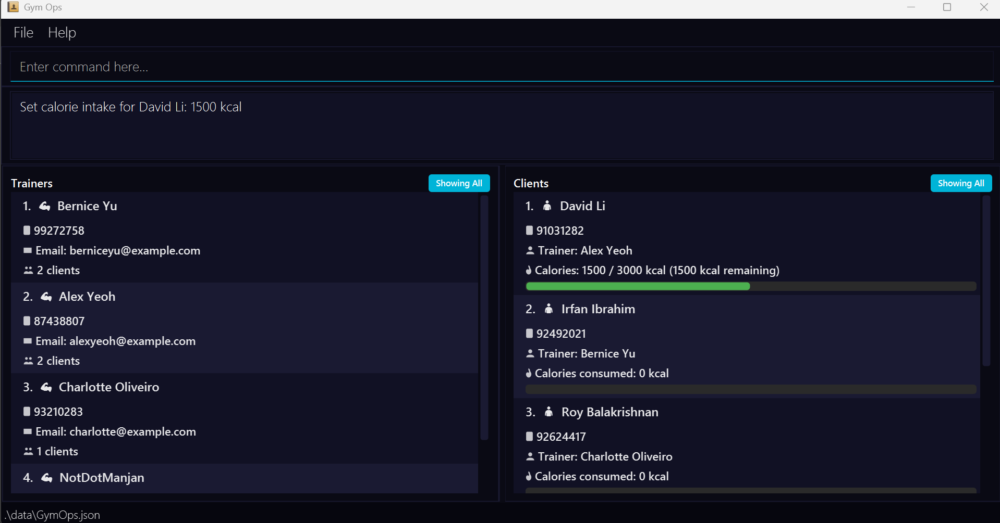

---

### Setting a workout focus: `set-focus`

Sets the primary workout focus for a client. Overwrites any existing focus.

Format: `set-focus c/CLIENT_INDEX f/FOCUS`

* `CLIENT_INDEX` must refer to a client in the **client list**.
* `FOCUS` must contain only letters (A–Z or a–z).

Examples:
* `set-focus c/1 f/Chest` — sets the 1st client's workout focus to "Chest".

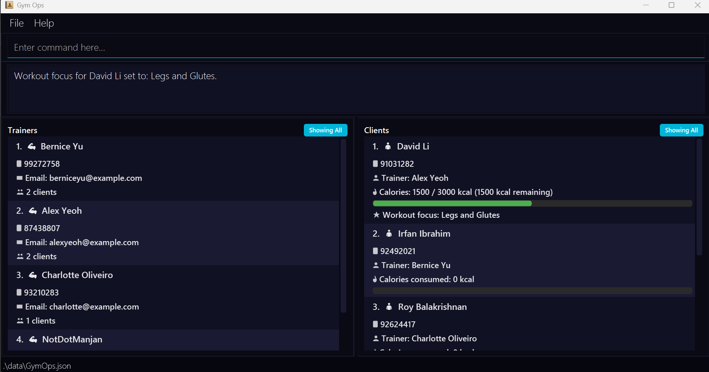

---

### Adding a remark: `remark`

Adds a remark to a client. Overwrites any existing remark.

Format: `remark INDEX r/REMARK`

* `INDEX` must refer to a client in the **client list**.
* `REMARK` must not be empty.

Examples:
* `remark 1 r/Recovering from ACL surgery`

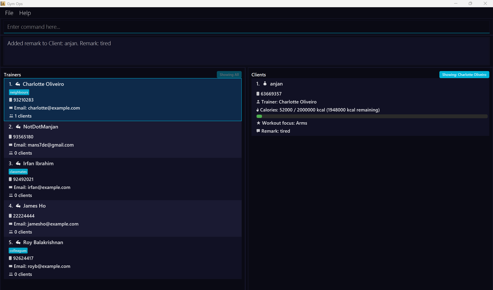

---

### Setting a membership validity: `set-validity`

Sets the membership validity date for a client. Overwrites any existing validity.

Format: `set-validity INDEX v/VALIDITY`

* `INDEX` must refer to a client in the **client list**.
* `VALIDITY` must be a valid date in the format `YYYY-MM-DD`.

Examples:
* `set-validity 1 v/2028-09-09` — sets the 1st client's membership validity to 09 Sep 2028.

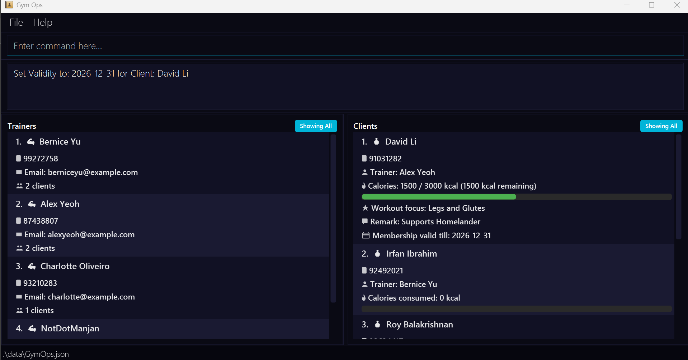

---

### Deleting a person: `delete`

Deletes a trainer or client using a typed prefix to specify the list.

Format: `delete t/TRAINER_INDEX` or `delete c/CLIENT_INDEX`

* `t/TRAINER_INDEX` refers to the index in the **trainer list**.
* `c/CLIENT_INDEX` refers to the index in the **client list**.

<div markdown="span" class="alert alert-warning">:exclamation: **Caution:** A trainer cannot be deleted if they still have active clients. Remove their clients first using `delete-client` or `delete c/...`.</div>

Examples:
* `delete t/2` — deletes the 2nd trainer.
* `delete c/1` — deletes the 1st client.

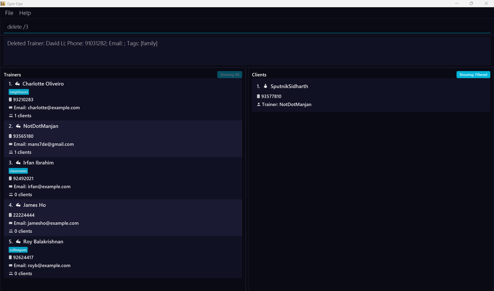

---

### Deleting a client: `delete-client`

Deletes a client from GymOps. The client is permanently removed and unassigned from their trainer.

Format: `delete-client INDEX`

* `INDEX` must refer to a client in the **client list**.

<div markdown="span" class="alert alert-info">:bulb: **Tip:** Run `find-clients NAME` first to locate the client, then use the index shown in the filtered list.</div>

Examples:
* `delete-client 1` — deletes the 1st client in the current list.

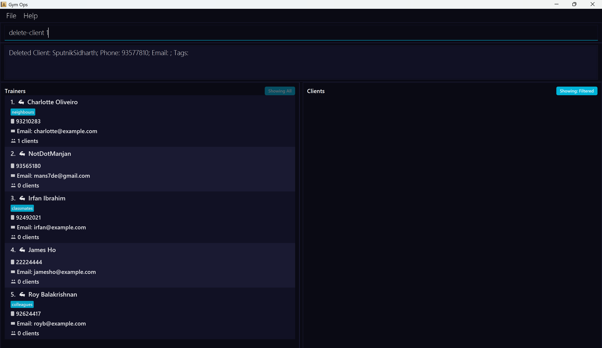

---

### Deleting a trainer: `delete-trainer`

Deletes a trainer from GymOps.

Format: `delete-trainer INDEX`

* `INDEX` must refer to a trainer in the **trainer list**.

<div markdown="span" class="alert alert-warning">:exclamation: **Caution:** A trainer cannot be deleted if they still have active clients. Use `delete-client` to remove their clients first.</div>

Examples:
* `delete-trainer 1` — deletes the 1st trainer.

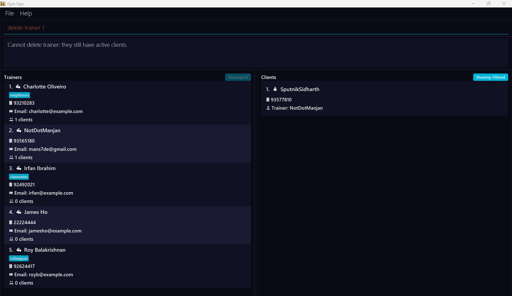

---

### Exporting data: `export`

Exports the current address book data to a JSON file at the specified location.

Format: `export FILE_PATH`

* `FILE_PATH` can be an absolute path (e.g., `C:/data/export.json` on Windows or `/Users/name/export.json` on macOS/Linux) or a relative path (e.g., `data/export.json` or `export.json`).
* If a relative path is provided, it is resolved relative to the folder where GymOps is executed.

Examples:
* `export data/my_export.json` — exports the current data to a file named `my_export.json` inside the `data` folder.

---

### Importing data: `import`

Imports address book data from a specified JSON file, replacing the current application data.

Format: `import FILE_PATH`

* `FILE_PATH` works exactly the same as in the `export` command (both absolute and relative paths are supported).

<div markdown="span" class="alert alert-warning">:exclamation: **Caution:** This action overwrites your existing data. Unsaved changes to the current session will be lost, and any data existing in the specified file will take their place.</div>

Examples:
* `import data/my_export.json` — imports the data from `my_export.json` into the application.

---

### Clearing all data: `clear`

Deletes all trainers and clients from GymOps.

Format: `clear`

<div markdown="span" class="alert alert-warning">:exclamation: **Caution:** This action is irreversible. All data will be permanently deleted.</div>

After clearing, GymOps will immediately save the empty data set to disk.

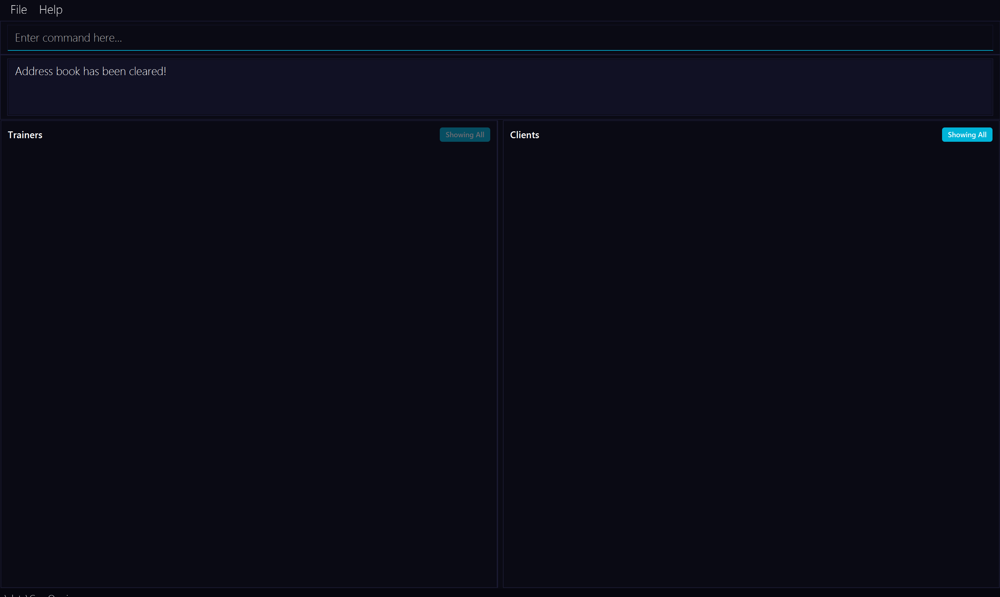

---

### Exiting GymOps: `exit`

Exits the application.

GymOps saves automatically, so you do not need to run any additional command before exiting.

Format: `exit`

---

### Saving data

GymOps saves data automatically after every command that modifies it. No manual saving is needed.

---

### Editing the data file

Data is saved as a JSON file at `[JAR file location]/data/GymOps.json`. Advanced users may edit this file directly.

<div markdown="span" class="alert alert-warning">:exclamation: **Caution:** If the file format becomes invalid, GymOps will discard all data and start fresh on the next run. Back up the file before editing it. Certain edits may also cause GymOps to behave unexpectedly if values fall outside acceptable ranges.</div>

---

### Archiving data files `[coming in v2.0]`

_Details coming soon._

---

## FAQ

**Q: How do I transfer my data to another computer?**

Install GymOps on the other computer and replace the empty data file it creates with your existing data file from `[JAR file location]/data/GymOps.json`.

---

## Known issues

1. **Multiple screens:** If you move the app to a secondary screen and later use only the primary screen, the GUI may open off-screen. Fix: delete `preferences.json` before restarting the app.
2. **Minimised Help Window:** Running `help` again while the Help Window is minimised will not open a new window. Fix: manually restore the minimised window.

---

## Command summary

| Action | Format | Example |
|--------|--------|---------|
| **Help** | `help` | — |
| **Add trainer** | `add-trainer n/NAME p/PHONE_NUMBER e/EMAIL` | `add-trainer n/John Doe p/98765432 e/johndoe@example.com` |
| **Add client** | `add-client n/NAME p/PHONE_NUMBER t/TRAINER_INDEX [v/VALIDITY]` | `add-client n/Alice Lim p/81234567 t/1 v/2028-09-09` |
| **Reassign client** | `reassign-client CLIENT_INDEX t/TRAINER_INDEX` | `reassign-client 2 t/1` |
| **List all** | `list` | — |
| **List trainers** | `list-trainers` | — |
| **List clients** | `list-clients` | — |
| **Trainer stats** | `stats` | — |
| **Find (both lists)** | `find KEYWORD [MORE_KEYWORDS]` | `find James Jake` |
| **Find trainers** | `find-trainers KEYWORD [MORE_KEYWORDS]` | `find-trainers John` |
| **Find clients** | `find-clients KEYWORD [MORE_KEYWORDS]` | `find-clients Alice` |
| **Set calorie target** | `set-calorie-target INDEX cal/CALORIES` | `set-calorie-target 1 cal/2400` |
| **Log calorie intake** | `log-calorie INDEX cal/CALORIES` | `log-calorie 1 cal/1500` |
| **Set workout focus** | `set-focus c/CLIENT_INDEX f/FOCUS` | `set-focus c/1 f/Chest` |
| **Remark** | `remark INDEX r/REMARK` | `remark 1 r/Recovering from ACL surgery` |
| **Set validity** | `set-validity INDEX v/VALIDITY` | `set-validity 1 v/2028-09-09` |
| **Delete (typed)** | `delete t/TRAINER_INDEX` or `delete c/CLIENT_INDEX` | `delete t/2`, `delete c/1` |
| **Delete client** | `delete-client INDEX` | `delete-client 1` |
| **Delete trainer** | `delete-trainer INDEX` | `delete-trainer 1` |
| **Export** | `export FILE_PATH` | `export data/export.json` |
| **Import** | `import FILE_PATH` | `import data/import.json` |
| **Clear** | `clear` | — |
| **Exit** | `exit` | — |
