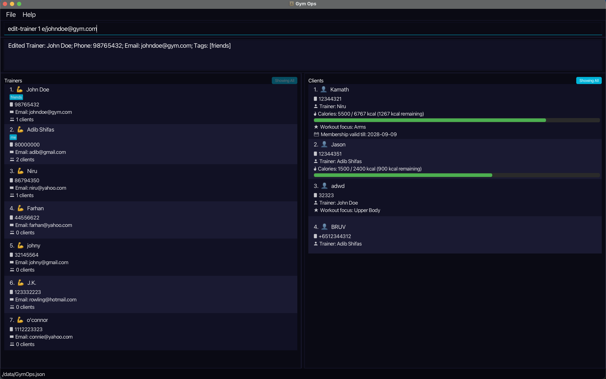

<a id="top"></a>

GymOps is a **desktop application for gym managers** to manage trainers and their clients. It is optimised for users who prefer a **Command Line Interface (CLI)** while still offering the benefits of a **Graphical User Interface (GUI)**.

---

## Introduction

### Who this guide is for

This guide is written for **gym managers and administrators** who want a fast, keyboard-driven way to manage their gym's roster. GymOps is designed for users comfortable with typing commands and working with indexed lists.

**We assume you:**
- Can open and use a terminal or command prompt
- Are comfortable typing commands with parameters
- Have Java 17 or above installed, or are able to install it
- Have basic familiarity with indexed lists (e.g. "the 2nd item in a list")

### How to use this guide

- **New to GymOps?** Start with [Quick Start](#quick-start) for installation and a first-use walkthrough.
- **Looking for a specific command?** Jump to [Features](#features) or the [Command Summary](#command-summary) at the end.
- **Having trouble?** Check [Known Issues](#known-issues) or [FAQ](#faq).

### Table of Contents
- [Introduction](#introduction)
  - [Who this guide is for](#who-this-guide-is-for)
  - [How to use this guide](#how-to-use-this-guide)
- [Quick Start](#quick-start)
- [Features](#features)
  - [General](#general)
    - [Viewing help](#viewing-help-help)
    - [Listing all persons](#listing-all-persons-list)
    - [Finding persons](#finding-persons-find)
    - [Deleting a person](#deleting-a-person-delete)
    - [Clearing all data](#clearing-all-data-clear)
    - [Exporting data](#exporting-data-export)
    - [Importing data](#importing-data-import)
    - [Exiting GymOps](#exiting-gymops-exit)
    - [Saving data](#saving-data)
    - [Do not edit the data file](#do-not-edit-the-data-file)
  - [Trainer Management](#trainer-management)
    - [Adding a trainer](#adding-a-trainer-add-t)
    - [Editing a trainer](#editing-a-trainer-edit-t)
    - [Listing all trainers](#listing-all-trainers-list-trainers)
    - [Finding trainers](#finding-trainers-find-trainers)
    - [Viewing trainer statistics](#viewing-trainer-statistics-stats)
  - [Client Management](#client-management)
    - [Adding a client](#adding-a-client-add-c)
    - [Editing a client](#editing-a-client-edit-c)
    - [Reassigning a client](#reassigning-a-client-reassign-c)
    - [Listing clients](#listing-clients-list-clients)
    - [Finding clients](#finding-clients-find-clients)
  - [Health Tracking](#health-tracking)
    - [Setting a calorie target](#setting-a-calorie-target-set-cal)
    - [Logging calorie intake](#logging-calorie-intake-log-cal)
    - [Setting a workout focus](#setting-a-workout-focus-set-focus)
    - [Adding a remark](#adding-a-remark-remark)
    - [Setting a membership validity](#setting-a-membership-validity-set-validity)
- [FAQ](#faq)
- [Known Issues](#known-issues)
- [Command Summary](#command-summary)

---

## Quick Start

1. Ensure you have **Java 17 or above** installed on your computer.

   **Mac users:** Install the precise JDK version prescribed [here](https://se-education.org/guides/tutorials/javaInstallationMac.html).

1. Download the latest `.jar` file from the [project's release page](https://github.com/AY2526S2-CS2103T-T17-1/tp/releases).

1. Copy the file to the folder you want to use as the _home folder_ for GymOps.

1. Open a terminal, `cd` into the folder containing the `.jar` file, and run:

   ```
   java -jar YOUR_FILE_NAME.jar
   ```

   If double-clicking the `.jar` does not launch GymOps on your system, use the terminal method above.

   The GymOps window will appear within a few seconds, pre-loaded with sample data.

   

   The window is split into two panels: **Trainers** (left) and **Clients** (right). Each panel shows a scrollable list of cards. Enter commands in the command box at the bottom and press **Enter** to execute them.

1. Try the following commands to get started:

   | Step | Command | What it does |
   |------|---------|-------------|
   | 1 | `list-trainers` | View all trainers |
   | 2 | `add-t n/John Doe p/98765432 e/johndoe@example.com` | Add a new trainer |
   | 3 | `list-trainers` | Confirm the trainer was added |
   | 4 | `add-c n/Alice Lim p/81234567 t/1 v/2028-09-09` | Assign a client to trainer #1 |
   | 5 | `find-clients Alice` | Search for the client you just added |
  | 6 | `delete c/1` | Delete the 1st client in the current list |
   | 7 | `clear` | Delete all data |
   | 8 | `exit` | Exit the app |

1. Refer to [Features](#features) for the full details of each command.

---

## Features

<div markdown="block" class="alert alert-info">

**:information_source: Notes about the command format:**

- Words in `UPPER_CASE` are parameters you supply. e.g. in `add-t n/NAME`, replace `NAME` with the actual name: `add-t n/John Doe`.
- Items in square brackets are optional. e.g. `find KEYWORD [MORE_KEYWORDS]` can be used as `find alice` or `find alice bob`.
- Parameters can be in any order. e.g. `n/NAME p/PHONE_NUMBER` and `p/PHONE_NUMBER n/NAME` are both valid.
- Extraneous parameters for commands that take no parameters (such as `help`, `list`, `exit`, and `clear`) will be ignored.
- An `INDEX` refers to the number shown in the **currently displayed list**, not the full unfiltered list.
- GymOps displays **two lists**: **Trainers** (left) and **Clients** (right). Trainer-related indexes refer to the trainer list; client-related indexes refer to the client list.
- If you are using a PDF version of this document, be careful when copying commands that span multiple lines, as spaces around line breaks may be lost.

</div>

### General

#### Viewing help: `help`

Opens the **Help Window**.

The Help Window contains:
- a link to the online User Guide (with a button to copy the URL), and
- a quick command summary.

If the Help Window is already open, running `help` will focus the existing window.

Format: `help`


**Expected outcome:** The Help Window opens or comes to the front, displaying a link to the User Guide and a command summary.

[⬆ Back to top](#top)

---

#### Listing all persons: `list`

Shows all trainers and all clients.

This command resets both lists to show all entries by clearing any active `find` filters.

<div markdown="span" class="alert alert-info">:bulb: **Tip:** To also clear a trainer selection made via the GUI, run `list-clients` (without an index) after `list`.</div>

Format: `list`

**Expected outcome:** Both the trainers and clients lists are refreshed to show all entries, and a success message is displayed.

[⬆ Back to top](#top)

---

#### Finding persons: `find`

Finds trainers and clients whose names contain any of the given keywords.

Format: `find KEYWORD [MORE_KEYWORDS]`

* The search is case-insensitive. e.g. `hans` matches `Hans`.
* The order of keywords does not matter. e.g. `Hans Bo` matches `Bo Hans`.
* Partial words are matched. e.g. `Han` matches `Hans`.
* Each keyword may only contain alphanumeric characters, periods, hyphens, apostrophes, and slashes. e.g. `Bob123`, `o'connor`, and `s/o` are valid; `Bob@` is not.
* Results include persons matching **at least one** keyword (OR search).
* Run `list` to return to the full list after searching.

<div markdown="span" class="alert alert-info">:bulb: **Tip:** Use `find-trainers` or `find-clients` to search within a specific list.</div>

Examples:
* `find John` — returns `john`, `John Doe`, `Johnny`
* `find alex david` — returns `Alex Yeoh`, `David Li`, `Alexander`


**Expected outcome:** Both lists are filtered to show only persons whose names contain the given keywords. A message showing the number of persons listed is displayed.

[⬆ Back to top](#top)

---

#### Deleting a person: `delete`

Deletes a trainer or client using a typed prefix to specify the list.

Format: `delete t/TRAINER_INDEX` or `delete c/CLIENT_INDEX`

* `t/TRAINER_INDEX` refers to the index in the **trainer list**.
* `c/CLIENT_INDEX` refers to the index in the **client list**.

<div markdown="span" class="alert alert-warning">:exclamation: **Caution:** A trainer cannot be deleted if they still have active clients. Remove their clients first using `delete c/...`.</div>

Examples:
* `delete t/2` — deletes the 2nd trainer.
* `delete c/1` — deletes the 1st client.

**Expected outcome:** The specified person is permanently removed from the application, and a success message is displayed.

[⬆ Back to top](#top)

---

#### Clearing all data: `clear`

Deletes all trainers and clients from GymOps.

Format: `clear`

<div markdown="span" class="alert alert-warning">:exclamation: **Caution:** This action is irreversible. All data will be permanently deleted.</div>

After clearing, GymOps will immediately save the empty data set to disk.

**Expected outcome:** All trainers and clients are removed from the application, the UI panels are cleared, and a success message is displayed.

[⬆ Back to top](#top)

---

#### Exporting data: `export`

Exports the current GymOps data to a JSON file at the specified location.

Format: `export FILE_PATH`

* `FILE_PATH` can be an absolute path (e.g., `C:/data/export.json` on Windows or `/Users/name/export.json` on macOS/Linux) or a relative path (e.g., `data/export.json` or `export.json`).
* If a relative path is provided, it is resolved relative to the folder where GymOps is executed.
* The file must have a `.json` extension. If the parent directory does not exist, it will be automatically created.

Examples:
* `export data/my_export.json` — exports the current data to a file named `my_export.json` inside the `data` folder.

**Expected outcome:** The current data is successfully exported to the specified file, and a success message is displayed.

[⬆ Back to top](#top)

---

#### Importing data: `import`

Imports GymOps data from a specified JSON file, replacing the current application data.

Format: `import FILE_PATH`

* `FILE_PATH` works exactly the same as in the `export` command (both absolute and relative paths are supported).

<div markdown="span" class="alert alert-warning">:exclamation: **Caution:** This action overwrites your existing data. Unsaved changes to the current session will be lost, and any data existing in the specified file will take their place.</div>

Examples:
* `import data/my_export.json` — imports the data from `my_export.json` into the application.

**Expected outcome:** The application's data is entirely replaced by the contents of the imported file. The UI refreshes to show the new data, and a success message is displayed.

[⬆ Back to top](#top)

---

#### Exiting GymOps: `exit`

Exits the application.

GymOps saves automatically, so you do not need to run any additional command before exiting.

Format: `exit`

**Expected outcome:** The application window safely closes and the program terminates.

[⬆ Back to top](#top)

---

#### Saving data

GymOps saves data automatically after every command that modifies it. No manual saving is needed.

---

#### Do not edit the data file

Data is saved as a JSON file at `[JAR file location]/data/GymOps.json`.
This file is **managed by GymOps** and is **not meant to be edited by hand**.

<div markdown="span" class="alert alert-warning">:exclamation: **Warning:** Do **not** edit `GymOps.json` manually. This is **unsupported** and may corrupt your data (or violate data constraints), causing GymOps to drop records or start with an empty dataset. GymOps also auto-saves after successful commands, so any manual changes may be overwritten. Use `export`/`import` for backups and transfers. If you need to move data by copying files, replace the whole file only while GymOps is **closed**.</div>

---

### Trainer Management

#### Adding a trainer: `add-t`

Adds a new trainer to GymOps.

Format: `add-t n/NAME p/PHONE_NUMBER e/EMAIL`

Examples:
* `add-t n/John Doe p/98765432 e/johndoe@example.com`


**Expected outcome:** The new trainer is added to the **Trainers** panel, and a success message is displayed.

[⬆ Back to top](#top)

---

#### Editing a trainer: `edit-t`

Edits the details of an existing trainer in GymOps. Use this command to update a trainer's name, phone number, or email address.

Format: `edit-t INDEX [n/NAME] [p/PHONE] [e/EMAIL]`

* `INDEX` must be a positive integer.
* At least one optional field must be provided.
* Existing values will be overwritten by the input values.

<div markdown="span" class="alert alert-info">:bulb: **Tip:** Run `list-trainers` to confirm the correct trainer index before editing.</div>

Examples:
* `edit-t 1 e/johndoe@gym.com` — updates the 1st trainer's email.
* `edit-t 2 n/Jane Doe p/92222222` — updates the 2nd trainer's name and phone.



**Expected outcome:** The trainer's details are updated in the list, and a success message is displayed.

[⬆ Back to top](#top)

---

#### Listing all trainers: `list-trainers`

Shows all trainers in GymOps. Clears any active trainer filter.

Format: `list-trainers`

**Expected outcome:** The trainers list is refreshed to show all trainers, and a success message is displayed.

[⬆ Back to top](#top)

---

#### Finding trainers: `find-trainers`

Finds trainers whose names contain any of the given keywords. Searches only the trainer list.

Format: `find-trainers KEYWORD [MORE_KEYWORDS]`

* Follows the same search rules as [`find`](#finding-persons-find) (case-insensitive, partial match, OR search, keyword character restrictions).
* Run `list-trainers` to return to the full trainer list after searching.

Examples:
* `find-trainers John` — returns all trainers with "John" in their name.

**Expected outcome:** The trainers list is filtered to show only trainers whose names contain the given keywords. A message showing the number of trainers listed is displayed.

[⬆ Back to top](#top)

---

#### Viewing trainer statistics: `stats`

Shows all trainers in GymOps, sorted by the number of clients they have in descending order. Trainers with the same number of clients will be sorted alphabetically by name.

Format: `stats`


**Expected outcome:** The trainer list is sorted by client count (descending), and a summary is shown.

[⬆ Back to top](#top)

---

### Client Management

#### Adding a client: `add-c`

Adds a new client and assigns them to an existing trainer.

Format: `add-c n/NAME p/PHONE_NUMBER t/TRAINER_INDEX [v/VALIDITY]`

* `TRAINER_INDEX` must refer to a trainer visible in the **current trainer list**.
* `VALIDITY` is an optional field that must be a valid date in the format `YYYY-MM-DD`. e.g. `v/2028-09-09`. Using a wrong format such as `v/09-09-2028` will show: `Validity should be a valid date in the format YYYY-MM-DD.`

<div markdown="span" class="alert alert-warning">:exclamation: **Caution:** If the trainer list is filtered (e.g. after a `find-trainers` command), `TRAINER_INDEX` refers to the filtered results. Run `list-trainers` first to assign by the full list.</div>

<div markdown="span" class="alert alert-info">:bulb: **Tip:** Run `list-trainers` to confirm the correct trainer index before adding a client.</div>

Examples:
* `add-c n/Alice Lim p/81234567 t/1` — adds Alice Lim and assigns her to the 1st trainer in the list.
* `add-c n/Alice Lim p/81234567 t/1 v/2028-09-09` — adds Alice Lim, assigns her to the 1st trainer, and sets her membership validity to 2028-09-09.


**Expected outcome:** The new client is assigned to the specified trainer, added to the **Clients** panel, and a success message is displayed.

[⬆ Back to top](#top)

---

#### Editing a client: `edit-c`

Edits the details of an existing client in GymOps. Use this command to update a client's name, phone number, assigned trainer, calorie target, workout focus, remark, or membership validity.

Format: `edit-c INDEX [n/NAME] [p/PHONE] [t/TRAINER_INDEX] [cal/CALORIE_TARGET] [f/FOCUS] [r/REMARK] [v/VALIDITY]`

* `INDEX` must be a positive integer.
* At least one optional field must be provided.
* Existing values will be overwritten by the input values.
* When editing the trainer assignment, `TRAINER_INDEX` must refer to a valid trainer.

<div markdown="span" class="alert alert-info">:bulb: **Tip:** Run `list-clients` to confirm the correct client index before editing.</div>

Examples:
* `edit-c 1 n/Alice Tan` — updates the 1st client's name to Alice Tan.
* `edit-c 2 p/91234567 cal/2000` — updates the 2nd client's phone and calorie target.
* `edit-c 1 t/2 f/Arms` — reassigns the 1st client to trainer #2 and sets focus to Arms.

[⬆ Back to top](#top)

---

#### Reassigning a client: `reassign-c`

Reassigns an existing client to a different trainer. All client data (calorie target, intake, workout focus, remark) is preserved.

Format: `reassign-c CLIENT_INDEX t/TRAINER_INDEX`

* `CLIENT_INDEX` must refer to a client in the **client list**.
* `TRAINER_INDEX` must refer to a trainer visible in the **current trainer list**.

<div markdown="span" class="alert alert-warning">:exclamation: **Caution:** If either list is filtered, indexes refer to the filtered results. Run `list` first to reassign using the full lists.</div>

Examples:
* `reassign-c 2 t/1` — reassigns the 2nd client to the 1st trainer.


**Expected outcome:** The client's assigned trainer is updated while preserving all other data. A success message is displayed.

[⬆ Back to top](#top)

---

#### Listing clients: `list-clients`

Shows all clients in GymOps, or only clients assigned to a specific trainer.

Format: `list-clients [TRAINER_INDEX]`

* If `TRAINER_INDEX` is omitted, shows all clients and clears any active trainer filter.
* If `TRAINER_INDEX` is provided, shows only clients assigned to the trainer at that index in the **current trainer list**.

<div markdown="span" class="alert alert-info">:bulb: **Tip:** After filtering clients by trainer (via the GUI or by using an index), run `list-clients` without an index to return to the full client list.</div>

Examples:
* `list-clients` — shows all clients.
* `list-clients 1` — shows only clients assigned to the 1st trainer in the current list.

**Expected outcome:** The clients list is refreshed to show either all clients or the specified trainer's clients, and a success message is displayed.

[⬆ Back to top](#top)

---

#### Finding clients: `find-clients`

Finds clients whose names contain any of the given keywords. Searches only the client list.

Format: `find-clients KEYWORD [MORE_KEYWORDS]`

* Follows the same search rules as [`find`](#finding-persons-find) (case-insensitive, partial match, OR search, keyword character restrictions).
* Run `list-clients` to return to the full client list after searching.

Examples:
* `find-clients Alice` — returns all clients with "Alice" in their name.
* `find-clients Alice Bob` — returns all clients with "Alice" or "Bob" in their name.

**Expected outcome:** The clients list is filtered to show only clients whose names contain the given keywords. A message showing the number of clients listed is displayed.

[⬆ Back to top](#top)

---

### Health Tracking

#### Setting a calorie target: `set-cal`

Sets the daily calorie target for a client.

Format: `set-cal c/CLIENT_INDEX cal/CALORIES`

* `CLIENT_INDEX` must refer to a client in the **client list**.
* `CALORIES` must be a non-negative integer. Use `0` to clear the calorie target.

Examples:
* `set-cal c/1 cal/2400` — sets a 2400-calorie daily target for the 1st client.
* `set-cal c/1 cal/0` — clears the calorie target for the 1st client.


**Expected outcome:** The client's calorie target is updated and displayed on their card. A success message is displayed.

[⬆ Back to top](#top)

---

#### Logging calorie intake: `log-cal`

Logs calorie intake for a client. The input overwrites the client's existing daily intake total.

Format: `log-cal c/CLIENT_INDEX cal/CALORIES`

* `CLIENT_INDEX` must refer to a client in the **client list**.
* `CALORIES` must be a non-negative integer. Use `0` to reset the client's intake total.

Examples:
* `log-cal c/1 cal/1500` — sets the 1st client's daily intake total to 1500 calories.
* `log-cal c/1 cal/0` — resets the 1st client's daily intake total to 0.


**Expected outcome:** The client's calorie intake total is updated. A success message is displayed.

If the client has a calorie target set, their card will also show their intake progress.

[⬆ Back to top](#top)

---

#### Setting a workout focus: `set-focus`

Sets the primary workout focus for a client. Overwrites any existing focus.

Format: `set-focus c/CLIENT_INDEX f/FOCUS`

* `CLIENT_INDEX` must refer to a client in the **client list**.
* `FOCUS` must contain only letters (A–Z or a–z), and words may be separated by single spaces. e.g. `Upper Body` is valid.

Examples:
* `set-focus c/1 f/Chest` — sets the 1st client's workout focus to "Chest".


**Expected outcome:** The client's workout focus is updated and displayed as a tag on their card. A success message is displayed.

[⬆ Back to top](#top)

---

#### Adding a remark: `remark`

Adds a remark to a client. Overwrites any existing remark.

Format: `remark c/CLIENT_INDEX r/REMARK`

* `CLIENT_INDEX` must refer to a client in the **client list**.
* `REMARK` must not be empty.

Examples:
* `remark c/1 r/Recovering from ACL surgery`


**Expected outcome:** The client's remark is updated and displayed on their card. A success message is displayed.

[⬆ Back to top](#top)

---

#### Setting a membership validity: `set-validity`

Sets the membership validity date for a client. Overwrites any existing validity.

Format: `set-validity INDEX v/VALIDITY`

* `INDEX` must refer to a client in the **client list**.
* `VALIDITY` must be a valid date in the format `YYYY-MM-DD`. e.g. `v/2028-09-09`. Using a wrong format such as `v/09-09-2028` will show: `Validity should be a valid date in the format YYYY-MM-DD.`
* The set validity date must not be in the past.
* GymOps currently displays the validity date but does not automatically enforce expiry or visually highlight expired memberships.

Examples:
* `set-validity 1 v/2028-09-09` — sets the 1st client's membership validity to 09 Sep 2028.


**Expected outcome:** The client's membership validity is updated and displayed on their card. A success message is displayed.

[⬆ Back to top](#top)

## FAQ

**Q: How do I transfer my data to another computer?**

Use `export` on the old computer and `import` on the new computer (recommended).

If you prefer copying files directly, install GymOps on the other computer and replace the empty data file it creates with your existing `[JAR file location]/data/GymOps.json` **while GymOps is closed**. Do not edit the contents of the file.

---

**Q: I opened `GymOps.json` and saw a `tags` section. Can I edit it?**

GymOps may contain fields in the data file that are **not exposed through the app’s UI/CLI** (e.g., legacy/internal fields such as `tags`).

No. Do **not** edit the data file contents. Manual edits are **unsupported** and a small mistake can prevent GymOps from loading your data (or cause it to load with missing data).

If your goal is to label or categorise people, use the supported in-app commands instead. If you are trying to move/backup data, use `export`/`import` (recommended) or replace the entire file while GymOps is closed.

---

**Q: Why can't I delete a trainer?**

A trainer cannot be deleted if they still have active clients. Use `delete c/` to remove all of the trainer's clients first, then delete the trainer.

---

**Q: How do I delete a trainer who is far down the list?**

Use a `find` command to filter the trainer list, then delete using the filtered index.

Example:
1. Run `find-trainers NAME` (or `find NAME`) to narrow down the trainer list.
1. Confirm the trainer’s index in the filtered **Trainers** list.
1. Run `delete t/TRAINER_INDEX` (e.g., `delete t/1`).

If you need to return to the full trainer list, run `list-trainers`.

---

**Q: Can I undo a command?**

GymOps does not currently support an undo command. Before running destructive commands like `clear` or `delete`, consider running `export` first to back up your data.

---

**Q: Why does my calorie intake not reset to zero each day?**

GymOps does not automatically reset daily calorie intake.

To correct a client's displayed intake total, use `log-cal` with the desired total.

To reset a client's intake total to 0, run `log-cal c/CLIENT_INDEX cal/0`.

---

## Known Issues

1. **Multiple screens:** If you move the app to a secondary screen and later use only the primary screen, the GUI may open off-screen. Fix: delete `preferences.json` (found in the same folder as the `.jar` file) before restarting the app.
2. **Minimised Help Window:** Running `help` again while the Help Window is minimised will not open a new window. Fix: manually restore the minimised window.
3. **Double-clicking the JAR:** On some systems, double-clicking the `.jar` may not start the app. Fix: run using `java -jar YOUR_FILE_NAME.jar` from a terminal.
4. **Write-protected folders:** If GymOps is placed in a write-protected folder, it may fail to save changes. Fix: move the `.jar` to a writable folder (e.g., your user directory) and run it from there.
5. **macOS fullscreen dialogs:** macOS users running secondary dialogs (e.g., Help Window) in fullscreen may encounter unexpected window behaviour. Fix: exit fullscreen for the main app window before opening dialogs.

---

## Command summary

| Action | Format | Example |
|--------|--------|---------|
| [**Help**](#viewing-help-help) | `help` | — |
| [**Add trainer**](#adding-a-trainer-add-t) | `add-t n/NAME p/PHONE_NUMBER e/EMAIL` | `add-t n/John Doe p/98765432 e/johndoe@example.com` |
| [**Edit trainer**](#editing-a-trainer-edit-t) | `edit-t INDEX [n/NAME] [p/PHONE] [e/EMAIL]` | `edit-t 1 n/Jane Doe e/jane@example.com` |
| [**Add client**](#adding-a-client-add-c) | `add-c n/NAME p/PHONE_NUMBER t/TRAINER_INDEX [v/VALIDITY]` | `add-c n/Alice Lim p/81234567 t/1 v/2028-09-09` |
| [**Edit client**](#editing-a-client-edit-c) | `edit-c INDEX [n/NAME] [p/PHONE] [t/TRAINER_INDEX] [cal/CALORIE_TARGET] [f/FOCUS] [r/REMARK] [v/VALIDITY]` | `edit-c 1 n/Alice Tan p/91234567` |
| [**Reassign client**](#reassigning-a-client-reassign-c) | `reassign-c CLIENT_INDEX t/TRAINER_INDEX` | `reassign-c 2 t/1` |
| [**List all**](#listing-all-persons-list) | `list` | — |
| [**List trainers**](#listing-all-trainers-list-trainers) | `list-trainers` | — |
| [**List clients**](#listing-clients-list-clients) | `list-clients [TRAINER_INDEX]` | `list-clients`, `list-clients 1` |
| [**Stats**](#viewing-trainer-statistics-stats) | `stats` | — |
| [**Find (both lists)**](#finding-persons-find) | `find KEYWORD [MORE_KEYWORDS]` | `find James Jake` |
| [**Find trainers**](#finding-trainers-find-trainers) | `find-trainers KEYWORD [MORE_KEYWORDS]` | `find-trainers John` |
| [**Find clients**](#finding-clients-find-clients) | `find-clients KEYWORD [MORE_KEYWORDS]` | `find-clients Alice` |
| [**Set calorie target**](#setting-a-calorie-target-set-cal) | `set-cal c/CLIENT_INDEX cal/CALORIES` | `set-cal c/1 cal/2400`, `set-cal c/1 cal/0` |
| [**Log calorie intake**](#logging-calorie-intake-log-cal) | `log-cal c/CLIENT_INDEX cal/CALORIES` | `log-cal c/1 cal/1500` |
| [**Set workout focus**](#setting-a-workout-focus-set-focus) | `set-focus c/CLIENT_INDEX f/FOCUS` | `set-focus c/1 f/Chest` |
| [**Remark**](#adding-a-remark-remark) | `remark c/CLIENT_INDEX r/REMARK` | `remark c/1 r/Recovering from ACL surgery` |
| [**Set validity**](#setting-a-membership-validity-set-validity) | `set-validity INDEX v/VALIDITY` | `set-validity 1 v/2028-09-09` |
| [**Delete (typed)**](#deleting-a-person-delete) | `delete t/TRAINER_INDEX` or `delete c/CLIENT_INDEX` | `delete t/2`, `delete c/1` |
| [**Export**](#exporting-data-export) | `export FILE_PATH` | `export data/export.json` |
| [**Import**](#importing-data-import) | `import FILE_PATH` | `import data/import.json` |
| [**Clear**](#clearing-all-data-clear) | `clear` | — |
| [**Exit**](#exiting-gymops-exit) | `exit` | — |
